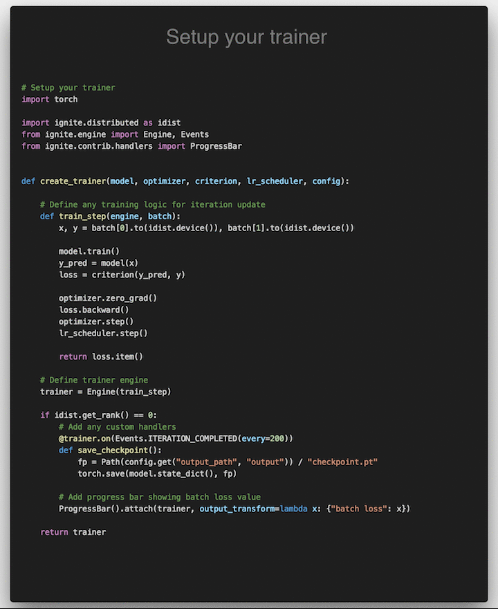

<div align="center">

<!--  -->


<!-- [](https://travis-ci.com/pytorch/ignite) -->

|  [](https://github.com/pytorch/ignite/actions) [](https://app.circleci.com/pipelines/github/pytorch/ignite?branch=master)[](https://app.circleci.com/pipelines/github/pytorch/ignite?branch=master) [](https://codecov.io/gh/pytorch/ignite) [](https://pytorch.org/ignite/index.html) |
|:---
|  [](https://anaconda.org/pytorch/ignite) [](https://anaconda.org/pytorch/ignite) [](https://pypi.org/project/pytorch-ignite/) [](https://pepy.tech/project/pytorch-ignite) |
|  [](https://anaconda.org/pytorch-nightly/ignite) [](https://pypi.org/project/pytorch-ignite/#history)|
|  [](https://hub.docker.com/u/pytorchignite) [](https://optuna.org) [](https://github.com/psf/black) |
|  [](https://twitter.com/pytorch_ignite) [](https://www.facebook.com/PyTorch-Ignite-Community-105837321694508) [](https://numfocus.org/sponsored-projects/affiliated-projects) [](https://discord.gg/djZtm3EmKj) |
|  [](https://github.com/pytorch/ignite/actions?query=workflow%3A%22PyTorch+version+tests%22)|

</div>

## TL;DR

Ignite is a high-level library to help with training and evaluating neural networks in PyTorch flexibly and transparently.

<div align="center">

<a href="https://colab.research.google.com/github/pytorch/ignite/blob/master/assets/tldr/teaser.ipynb">
 
</a>

_Click on the image to see complete code_

</div>

### Features

- [Less code than pure PyTorch](https://raw.githubusercontent.com/pytorch/ignite/master/assets/ignite_vs_bare_pytorch.png)
  while ensuring maximum control and simplicity

- Library approach and no program's control inversion - _Use ignite where and when you need_

- Extensible API for metrics, experiment managers, and other components

<!-- ############################################################################################################### -->

# Table of Contents

- [Table of Contents](#table-of-contents)
- [Why Ignite?](#why-ignite)
  - [Simplified training and validation loop](#simplified-training-and-validation-loop)
  - [Power of Events & Handlers](#power-of-events--handlers)
    - [Execute any number of functions whenever you wish](#execute-any-number-of-functions-whenever-you-wish)
    - [Built-in events filtering](#built-in-events-filtering)
    - [Stack events to share some actions](#stack-events-to-share-some-actions)
    - [Custom events to go beyond standard events](#custom-events-to-go-beyond-standard-events)
  - [Out-of-the-box metrics](#out-of-the-box-metrics)
- [Installation](#installation)
  - [Nightly releases](#nightly-releases)
  - [Docker Images](#docker-images)
    - [Using pre-built images](#using-pre-built-images)
- [Getting Started](#getting-started)
- [Documentation](#documentation)
  - [Additional Materials](#additional-materials)
- [Examples](#examples)
  - [Tutorials](#tutorials)
  - [Reproducible Training Examples](#reproducible-training-examples)
- [Communication](#communication)
  - [User feedback](#user-feedback)
- [Contributing](#contributing)
- [Projects using Ignite](#projects-using-ignite)
- [Citing Ignite](#citing-ignite)
- [About the team & Disclaimer](#about-the-team--disclaimer)

<!-- ############################################################################################################### -->

# Why Ignite?

Ignite is a **library** that provides three high-level features:

- Extremely simple engine and event system
- Out-of-the-box metrics to easily evaluate models
- Built-in handlers to compose training pipeline, save artifacts and log parameters and metrics

## Simplified training and validation loop

No more coding `for/while` loops on epochs and iterations. Users instantiate engines and run them.

<details>
<summary>
Example
</summary>

```python
from ignite.engine import Engine, Events, create_supervised_evaluator
from ignite.metrics import Accuracy


# Setup training engine:
def train_step(engine, batch):
    # Users can do whatever they need on a single iteration
    # Eg. forward/backward pass for any number of models, optimizers, etc
    # ...

trainer = Engine(train_step)

# Setup single model evaluation engine
evaluator = create_supervised_evaluator(model, metrics={"accuracy": Accuracy()})

def validation():
    state = evaluator.run(validation_data_loader)
    # print computed metrics
    print(trainer.state.epoch, state.metrics)

# Run model's validation at the end of each epoch
trainer.add_event_handler(Events.EPOCH_COMPLETED, validation)

# Start the training
trainer.run(training_data_loader, max_epochs=100)
```

</details>

## Power of Events & Handlers

The cool thing with handlers is that they offer unparalleled flexibility (compared to, for example, callbacks). Handlers can be any function: e.g. lambda, simple function, class method, etc. Thus, we do not require to inherit from an interface and override its abstract methods which could unnecessarily bulk up your code and its complexity.

### Execute any number of functions whenever you wish

<details>
<summary>
Examples
</summary>

```python
trainer.add_event_handler(Events.STARTED, lambda _: print("Start training"))

# attach handler with args, kwargs
mydata = [1, 2, 3, 4]
logger = ...

def on_training_ended(data):
    print(f"Training is ended. mydata={data}")
    # User can use variables from another scope
    logger.info("Training is ended")


trainer.add_event_handler(Events.COMPLETED, on_training_ended, mydata)
# call any number of functions on a single event
trainer.add_event_handler(Events.COMPLETED, lambda engine: print(engine.state.times))

@trainer.on(Events.ITERATION_COMPLETED)
def log_something(engine):
    print(engine.state.output)
```

</details>

### Built-in events filtering

<details>
<summary>
Examples
</summary>

```python
# run the validation every 5 epochs
@trainer.on(Events.EPOCH_COMPLETED(every=5))
def run_validation():
    # run validation

# change some training variable once on 20th epoch
@trainer.on(Events.EPOCH_STARTED(once=20))
def change_training_variable():
    # ...

# Trigger handler with customly defined frequency
@trainer.on(Events.ITERATION_COMPLETED(event_filter=first_x_iters))
def log_gradients():
    # ...
```

</details>

### Stack events to share some actions

<details>
<summary>
Examples
</summary>

Events can be stacked together to enable multiple calls:

```python
@trainer.on(Events.COMPLETED | Events.EPOCH_COMPLETED(every=10))
def run_validation():
    # ...
```

</details>

### Custom events to go beyond standard events

<details>
<summary>
Examples
</summary>

Custom events related to backward and optimizer step calls:

```python
from ignite.engine import EventEnum


class BackpropEvents(EventEnum):
    BACKWARD_STARTED = 'backward_started'
    BACKWARD_COMPLETED = 'backward_completed'
    OPTIM_STEP_COMPLETED = 'optim_step_completed'

def update(engine, batch):
    # ...
    loss = criterion(y_pred, y)
    engine.fire_event(BackpropEvents.BACKWARD_STARTED)
    loss.backward()
    engine.fire_event(BackpropEvents.BACKWARD_COMPLETED)
    optimizer.step()
    engine.fire_event(BackpropEvents.OPTIM_STEP_COMPLETED)
    # ...

trainer = Engine(update)
trainer.register_events(*BackpropEvents)

@trainer.on(BackpropEvents.BACKWARD_STARTED)
def function_before_backprop(engine):
    # ...
```

- Complete snippet is found [here](https://pytorch.org/ignite/faq.html#creating-custom-events-based-on-forward-backward-pass).
- Another use-case of custom events: [trainer for Truncated Backprop Through Time](https://pytorch.org/ignite/contrib/engines.html#ignite.contrib.engines.create_supervised_tbptt_trainer).

</details>

## Out-of-the-box metrics

- [Metrics](https://pytorch.org/ignite/metrics.html#complete-list-of-metrics) for various tasks:
  Precision, Recall, Accuracy, Confusion Matrix, IoU etc, ~20 [regression metrics](https://pytorch.org/ignite/contrib/metrics.html#regression-metrics).

- Users can also [compose their metrics](https://pytorch.org/ignite/metrics.html#metric-arithmetics) with ease from
  existing ones using arithmetic operations or torch methods.

<details>
<summary>
Example
</summary>

```python
precision = Precision(average=False)
recall = Recall(average=False)
F1_per_class = (precision * recall * 2 / (precision + recall))
F1_mean = F1_per_class.mean()  # torch mean method
F1_mean.attach(engine, "F1")
```

</details>

<!-- ############################################################################################################### -->

# Installation

From [pip](https://pypi.org/project/pytorch-ignite/):

```bash
pip install pytorch-ignite
```

From [conda](https://anaconda.org/pytorch/ignite):

```bash
conda install ignite -c pytorch
```

From source:

```bash
pip install git+https://github.com/pytorch/ignite
```

## Nightly releases

From pip:

```bash
pip install --pre pytorch-ignite
```

From conda (this suggests to install [pytorch nightly release](https://anaconda.org/pytorch-nightly/pytorch) instead of stable
version as dependency):

```bash
conda install ignite -c pytorch-nightly
```

## Docker Images

### Using pre-built images

Pull a pre-built docker image from [our Docker Hub](https://hub.docker.com/u/pytorchignite) and run it with docker v19.03+.

```bash
docker run --gpus all -it -v $PWD:/workspace/project --network=host --shm-size 16G pytorchignite/base:latest /bin/bash
```

<details>

<summary>
List of available pre-built images
</summary>

Base
- `pytorchignite/base:latest` 
- `pytorchignite/apex:latest`
- `pytorchignite/hvd-base:latest`
- `pytorchignite/hvd-apex:latest` 
- `pytorchignite/msdp-apex:latest`

Vision:
- `pytorchignite/vision:latest`
- `pytorchignite/hvd-vision:latest`
- `pytorchignite/apex-vision:latest`
- `pytorchignite/hvd-apex-vision:latest`
- `pytorchignite/msdp-apex-vision:latest`

NLP:
- `pytorchignite/nlp:latest`
- `pytorchignite/hvd-nlp:latest`
- `pytorchignite/apex-nlp:latest` 
- `pytorchignite/hvd-apex-nlp:latest` 
- `pytorchignite/msdp-apex-nlp:latest`

</details>

For more details, see [here](docker).

<!-- ############################################################################################################### -->

# Getting Started

Few pointers to get you started:

- [Quick Start Guide: Essentials of getting a project up and running](https://pytorch.org/ignite/quickstart.html)
- [Concepts of the library: Engine, Events & Handlers, State, Metrics](https://pytorch.org/ignite/concepts.html)
- Full-featured template examples (coming soon)

<!-- ############################################################################################################### -->

# Documentation

- Stable API documentation and an overview of the library: https://pytorch.org/ignite/
- Development version API documentation: https://pytorch.org/ignite/master/
- [FAQ](https://pytorch.org/ignite/faq.html),
  ["Questions on Github"](https://github.com/pytorch/ignite/issues?q=is%3Aissue+label%3Aquestion+) and
  ["Questions on Discuss.PyTorch"](https://discuss.pytorch.org/c/ignite).
- [Project's Roadmap](https://github.com/pytorch/ignite/wiki/Roadmap)

## Additional Materials

- [Distributed Training Made Easy with PyTorch-Ignite](https://labs.quansight.org/blog/2021/06/distributed-made-easy-with-ignite/)
- [PyTorch Ecosystem Day 2021 Breakout session presentation](https://colab.research.google.com/drive/1qhUgWQ0N2U71IVShLpocyeY4AhlDCPRd)
- [Tutorial blog post about PyTorch-Ignite](https://labs.quansight.org/blog/2020/09/pytorch-ignite/)
- [8 Creators and Core Contributors Talk About Their Model Training Libraries From PyTorch Ecosystem](https://neptune.ai/blog/model-training-libraries-pytorch-ecosystem?utm_source=reddit&utm_medium=post&utm_campaign=blog-model-training-libraries-pytorch-ecosystem)
- Ignite Posters from Pytorch Developer Conferences:
  - [2021](https://drive.google.com/file/d/1YXrkJIepPk_KltSG1ZfWRtA5IRgPFz_U)
  - [2019](https://drive.google.com/open?id=1bqIl-EM6GCCCoSixFZxhIbuF25F2qTZg)
  - [2018](https://drive.google.com/open?id=1_2vzBJ0KeCjGv1srojMHiJRvceSVbVR5)

<!-- ############################################################################################################### -->

# Examples

## Tutorials

- [](https://colab.research.google.com/github/pytorch/ignite/blob/master/examples/notebooks/TextCNN.ipynb) [Text Classification using Convolutional Neural
  Networks](https://github.com/pytorch/ignite/blob/master/examples/notebooks/TextCNN.ipynb)
- [](https://colab.research.google.com/github/pytorch/ignite/blob/master/examples/notebooks/VAE.ipynb) [Variational Auto
  Encoders](https://github.com/pytorch/ignite/blob/master/examples/notebooks/VAE.ipynb)
- [](https://colab.research.google.com/github/pytorch/ignite/blob/master/examples/notebooks/FashionMNIST.ipynb) [Convolutional Neural Networks for Classifying Fashion-MNIST
  Dataset](https://github.com/pytorch/ignite/blob/master/examples/notebooks/FashionMNIST.ipynb)
- [](https://colab.research.google.com/github/pytorch/ignite/blob/master/examples/notebooks/CycleGAN_with_nvidia_apex.ipynb) [Training Cycle-GAN on Horses to
  Zebras with Nvidia/Apex](https://github.com/pytorch/ignite/blob/master/examples/notebooks/CycleGAN_with_nvidia_apex.ipynb) - [ logs on W&B](https://app.wandb.ai/vfdev-5/ignite-cyclegan-apex)
- [](https://colab.research.google.com/github/pytorch/ignite/blob/master/examples/notebooks/CycleGAN_with_torch_cuda_amp.ipynb) [Another training Cycle-GAN on Horses to
  Zebras with Native Torch CUDA AMP](https://github.com/pytorch/ignite/blob/master/examples/notebooks/CycleGAN_with_torch_cuda_amp.ipynb) - [logs on W&B](https://app.wandb.ai/vfdev-5/ignite-cyclegan-torch-amp)
- [](https://colab.research.google.com/github/pytorch/ignite/blob/master/examples/notebooks/EfficientNet_Cifar100_finetuning.ipynb) [Finetuning EfficientNet-B0 on
  CIFAR100](https://github.com/pytorch/ignite/blob/master/examples/notebooks/EfficientNet_Cifar100_finetuning.ipynb)
- [](https://colab.research.google.com/github/pytorch/ignite/blob/master/examples/notebooks/Cifar10_Ax_hyperparam_tuning.ipynb) [Hyperparameters tuning with
  Ax](https://github.com/pytorch/ignite/blob/master/examples/notebooks/Cifar10_Ax_hyperparam_tuning.ipynb)
- [](https://colab.research.google.com/github/pytorch/ignite/blob/master/examples/notebooks/FastaiLRFinder_MNIST.ipynb) [Basic example of LR finder on
  MNIST](https://github.com/pytorch/ignite/blob/master/examples/notebooks/FastaiLRFinder_MNIST.ipynb)
- [](https://colab.research.google.com/github/pytorch/ignite/blob/master/examples/notebooks/Cifar100_bench_amp.ipynb) [Benchmark mixed precision training on Cifar100:
  torch.cuda.amp vs nvidia/apex](https://github.com/pytorch/ignite/blob/master/examples/notebooks/Cifar100_bench_amp.ipynb)
- [](https://colab.research.google.com/github/pytorch/ignite/blob/master/examples/notebooks/MNIST_on_TPU.ipynb) [MNIST training on a single
  TPU](https://github.com/pytorch/ignite/blob/master/examples/notebooks/MNIST_on_TPU.ipynb)
- [](https://colab.research.google.com/drive/1E9zJrptnLJ_PKhmaP5Vhb6DTVRvyrKHx) [CIFAR10 Training on multiple TPUs](https://github.com/pytorch/ignite/tree/master/examples/contrib/cifar10)
- [](https://colab.research.google.com/github/pytorch/ignite/blob/master/examples/notebooks/HandlersTimeProfiler_MNIST.ipynb) [Basic example of handlers
  time profiling on MNIST training example](https://github.com/pytorch/ignite/blob/master/examples/notebooks/HandlersTimeProfiler_MNIST.ipynb)

## Reproducible Training Examples

Inspired by [torchvision/references](https://github.com/pytorch/vision/tree/master/references),
we provide several reproducible baselines for vision tasks:

- [ImageNet](examples/references/classification/imagenet) - logs on Ignite Trains server coming soon ...
- [Pascal VOC2012](examples/references/segmentation/pascal_voc2012) - logs on Ignite Trains server coming soon ...

Features:

- Distributed training: native or horovod and using [PyTorch native AMP](https://pytorch.org/docs/stable/notes/amp_examples.html)

## Code-Generator application

The easiest way to create your training scripts with PyTorch-Ignite:
- https://code-generator.pytorch-ignite.ai/


<!-- ############################################################################################################### -->

# Communication

- [GitHub issues](https://github.com/pytorch/ignite/issues): questions, bug reports, feature requests, etc.

- [Discuss.PyTorch](https://discuss.pytorch.org/c/ignite), category "Ignite".

- [PyTorch-Ignite Discord Server](https://discord.gg/djZtm3EmKj): to chat with the community

- [GitHub Discussions](https://github.com/pytorch/ignite/discussions): general library-related discussions, ideas, Q&A, etc.

## User feedback

We have created a form for ["user feedback"](https://github.com/pytorch/ignite/issues/new/choose). We
appreciate any type of feedback, and this is how we would like to see our
community:

- If you like the project and want to say thanks, this the right
  place.
- If you do not like something, please, share it with us, and we can
  see how to improve it.

Thank you!

<!-- ############################################################################################################### -->

# Contributing

Please see the [contribution guidelines](https://github.com/pytorch/ignite/blob/master/CONTRIBUTING.md) for more information.

As always, PRs are welcome :)

<!-- ############################################################################################################### -->

# Projects using Ignite

<details>

<summary>
Research papers
</summary>

- [BatchBALD: Efficient and Diverse Batch Acquisition for Deep Bayesian Active Learning](https://github.com/BlackHC/BatchBALD)
- [A Model to Search for Synthesizable Molecules](https://github.com/john-bradshaw/molecule-chef)
- [Localised Generative Flows](https://github.com/jrmcornish/lgf)
- [Extracting T Cell Function and Differentiation Characteristics from the Biomedical Literature](https://github.com/hammerlab/t-cell-relation-extraction)
- [Variational Information Distillation for Knowledge Transfer](https://github.com/amzn/xfer/tree/master/var_info_distil)
- [XPersona: Evaluating Multilingual Personalized Chatbot](https://github.com/HLTCHKUST/Xpersona)
- [CNN-CASS: CNN for Classification of Coronary Artery Stenosis Score in MPR Images](https://github.com/ucuapps/CoronaryArteryStenosisScoreClassification)
- [Bridging Text and Video: A Universal Multimodal Transformer for Video-Audio Scene-Aware Dialog](https://github.com/ictnlp/DSTC8-AVSD)
- [Adversarial Decomposition of Text Representation](https://github.com/text-machine-lab/adversarial_decomposition)
- [Uncertainty Estimation Using a Single Deep Deterministic Neural Network](https://github.com/y0ast/deterministic-uncertainty-quantification)
- [DeepSphere: a graph-based spherical CNN](https://github.com/deepsphere/deepsphere-pytorch)
- [Norm-in-Norm Loss with Faster Convergence and Better Performance for Image Quality Assessment](https://github.com/lidq92/LinearityIQA)
- [Unified Quality Assessment of In-the-Wild Videos with Mixed Datasets Training](https://github.com/lidq92/MDTVSFA)
- [Deep Signature Transforms](https://github.com/patrick-kidger/Deep-Signature-Transforms)
- [Neural CDEs for Long Time-Series via the Log-ODE Method](https://github.com/jambo6/neuralCDEs-via-logODEs)
- [Volumetric Grasping Network](https://github.com/ethz-asl/vgn)
- [Mood Classification using Listening Data](https://github.com/fdlm/listening-moods)
- [Deterministic Uncertainty Estimation (DUE)](https://github.com/y0ast/DUE)
- [PyTorch-Hebbian: facilitating local learning in a deep learning framework](https://github.com/Joxis/pytorch-hebbian)
- [Stochastic Weight Matrix-Based Regularization Methods for Deep Neural Networks](https://github.com/rpatrik96/lod-wmm-2019)
- [Learning explanations that are hard to vary](https://github.com/gibipara92/learning-explanations-hard-to-vary)
- [The role of disentanglement in generalisation](https://github.com/mmrl/disent-and-gen)
- [A Probabilistic Programming Approach to Protein Structure Superposition](https://github.com/LysSanzMoreta/Theseus-PP)
- [PadChest: A large chest x-ray image dataset with multi-label annotated reports](https://github.com/auriml/Rx-thorax-automatic-captioning)

</details>

<details>

<summary>
Blog articles, tutorials, books
</summary>

- [State-of-the-Art Conversational AI with Transfer Learning](https://github.com/huggingface/transfer-learning-conv-ai)
- [Tutorial on Transfer Learning in NLP held at NAACL 2019](https://github.com/huggingface/naacl_transfer_learning_tutorial)
- [Deep-Reinforcement-Learning-Hands-On-Second-Edition, published by Packt](https://github.com/PacktPublishing/Deep-Reinforcement-Learning-Hands-On-Second-Edition)
- [Once Upon a Repository: How to Write Readable, Maintainable Code with PyTorch](https://towardsdatascience.com/once-upon-a-repository-how-to-write-readable-maintainable-code-with-pytorch-951f03f6a829)
- [The Hero Rises: Build Your Own SSD](https://allegro.ai/blog/the-hero-rises-build-your-own-ssd/)
- [Using Optuna to Optimize PyTorch Ignite Hyperparameters](https://medium.com/pytorch/using-optuna-to-optimize-pytorch-ignite-hyperparameters-626ffe6d4783)
- [PyTorch Ignite - Classifying Tiny ImageNet with EfficientNet](https://towardsdatascience.com/pytorch-ignite-classifying-tiny-imagenet-with-efficientnet-e5b1768e5e8f)
 
</details>

<details>

<summary>
Toolkits
</summary>

- [Project MONAI - AI Toolkit for Healthcare Imaging](https://github.com/Project-MONAI/MONAI)
- [DeepSeismic - Deep Learning for Seismic Imaging and Interpretation](https://github.com/microsoft/seismic-deeplearning)
- [Nussl - a flexible, object-oriented Python audio source separation library](https://github.com/nussl/nussl)

</details>

<details>

<summary>
Others
</summary>

- [Implementation of "Attention is All You Need" paper](https://github.com/akurniawan/pytorch-transformer)
- [Implementation of DropBlock: A regularization method for convolutional networks in PyTorch](https://github.com/miguelvr/dropblock)
- [Kaggle Kuzushiji Recognition: 2nd place solution](https://github.com/lopuhin/kaggle-kuzushiji-2019)
- [Unsupervised Data Augmentation experiments in PyTorch](https://github.com/vfdev-5/UDA-pytorch)
- [Hyperparameters tuning with Optuna](https://github.com/optuna/optuna-examples/blob/main/pytorch/pytorch_ignite_simple.py)
- [Logging with ChainerUI](https://chainerui.readthedocs.io/en/latest/reference/module.html#external-library-support)
- [FixMatch experiments in PyTorch and Ignite (CTA dataaug policy)](https://github.com/vfdev-5/FixMatch-pytorch)
- [Kaggle Birdcall Identification Competition: 1st place solution](https://github.com/ryanwongsa/kaggle-birdsong-recognition)

</details>

See other projects at ["Used by"](https://github.com/pytorch/ignite/network/dependents?package_id=UGFja2FnZS02NzI5ODEwNA%3D%3D)

If your project implements a paper, represents other use-cases not
covered in our official tutorials, Kaggle competition's code, or just
your code presents interesting results and uses Ignite. We would like to
add your project to this list, so please send a PR with brief
description of the project.

<!-- ############################################################################################################### -->

# Citing Ignite

If you use PyTorch-Ignite in a scientific publication, we would appreciate citations to our project.

```
@misc{pytorch-ignite,
  author = {V. Fomin and J. Anmol and S. Desroziers and J. Kriss and A. Tejani},
  title = {High-level library to help with training neural networks in PyTorch},
  year = {2020},
  publisher = {GitHub},
  journal = {GitHub repository},
  howpublished = {\url{https://github.com/pytorch/ignite}},
}
```

<!-- ############################################################################################################### -->

# About the team & Disclaimer

PyTorch-Ignite is a [NumFOCUS Affiliated Project](https://www.numfocus.org/), operated and maintained by volunteers in the PyTorch community in their capacities as individuals
(and not as representatives of their employers). See the ["About us"](https://pytorch.org/ignite/master/about.html)
page for a list of core contributors. For usage questions and issues, please see the various channels
[here](#communication). For all other questions and inquiries, please send an email
to contact@pytorch-ignite.ai.
