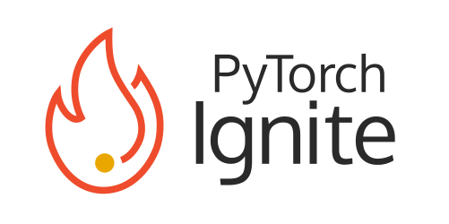

<div align="center">

<!--  -->


<!-- [](https://travis-ci.com/pytorch/ignite) -->

|  [](https://github.com/pytorch/ignite/actions) [](https://app.circleci.com/pipelines/github/pytorch/ignite?branch=master)[](https://app.circleci.com/pipelines/github/pytorch/ignite?branch=master) [](https://codecov.io/gh/pytorch/ignite) [](https://pytorch.org/ignite/index.html) |
|:---
|  [](https://anaconda.org/pytorch/ignite) [](https://anaconda.org/pytorch/ignite) [](https://pypi.org/project/pytorch-ignite/) [](https://pepy.tech/project/pytorch-ignite) |
|  [](https://anaconda.org/pytorch-nightly/ignite) [](https://pypi.org/project/pytorch-ignite/#history)|
|  [](https://hub.docker.com/u/pytorchignite) [](https://optuna.org) [](https://github.com/psf/black) |
|  [](https://twitter.com/pytorch_ignite) [](https://www.facebook.com/PyTorch-Ignite-Community-105837321694508) [](https://numfocus.org/sponsored-projects/affiliated-projects) [](https://discord.gg/djZtm3EmKj) |
|  [](https://github.com/pytorch/ignite/actions?query=workflow%3A%22PyTorch+version+tests%22)|

</div>

## TL;DR

Ignite is a high-level library to help with training and evaluating neural networks in PyTorch flexibly and transparently.

<div align="center">

<a href="https://colab.research.google.com/github/pytorch/ignite/blob/master/assets/tldr/teaser.ipynb">
 
</a>

_Click on the image to see complete code_

</div>

### Features

- [Less code than pure PyTorch](https://raw.githubusercontent.com/pytorch/ignite/master/assets/ignite_vs_bare_pytorch.png)
  while ensuring maximum control and simplicity

- Library approach and no program's control inversion - _Use ignite where and when you need_

- Extensible API for metrics, experiment managers, and other components

<!-- ############################################################################################################### -->

# Why Ignite?

Ignite is a **library** that provides three high-level features:

- Extremely simple engine and event system
- Out-of-the-box metrics to easily evaluate models
- Built-in handlers to compose training pipeline, save artifacts and log parameters and metrics

## Simplified training and validation loop

No more coding `for/while` loops on epochs and iterations. Users instantiate engines and run them.

<details>
<summary>
Example
</summary>

```python
from ignite.engine import Engine, Events, create_supervised_evaluator
from ignite.metrics import Accuracy


# Setup training engine:
def train_step(engine, batch):
    # Users can do whatever they need on a single iteration
    # Eg. forward/backward pass for any number of models, optimizers, etc
    # ...

trainer = Engine(train_step)

# Setup single model evaluation engine
evaluator = create_supervised_evaluator(model, metrics={"accuracy": Accuracy()})

def validation():
    state = evaluator.run(validation_data_loader)
    # print computed metrics
    print(trainer.state.epoch, state.metrics)

# Run model's validation at the end of each epoch
trainer.add_event_handler(Events.EPOCH_COMPLETED, validation)

# Start the training
trainer.run(training_data_loader, max_epochs=100)
```

</details>

## Power of Events & Handlers

The cool thing with handlers is that they offer unparalleled flexibility (compared to, for example, callbacks). Handlers can be any function: e.g. lambda, simple function, class method, etc. Thus, we do not require to inherit from an interface and override its abstract methods which could unnecessarily bulk up your code and its complexity.

### Execute any number of functions whenever you wish

<details>
<summary>
Examples
</summary>

```python
trainer.add_event_handler(Events.STARTED, lambda _: print("Start training"))

# attach handler with args, kwargs
mydata = [1, 2, 3, 4]
logger = ...

def on_training_ended(data):
    print(f"Training is ended. mydata={data}")
    # User can use variables from another scope
    logger.info("Training is ended")


trainer.add_event_handler(Events.COMPLETED, on_training_ended, mydata)
# call any number of functions on a single event
trainer.add_event_handler(Events.COMPLETED, lambda engine: print(engine.state.times))

@trainer.on(Events.ITERATION_COMPLETED)
def log_something(engine):
    print(engine.state.output)
```

</details>

### Built-in events filtering

<details>
<summary>
Examples
</summary>

```python
# run the validation every 5 epochs
@trainer.on(Events.EPOCH_COMPLETED(every=5))
def run_validation():
    # run validation

# change some training variable once on 20th epoch
@trainer.on(Events.EPOCH_STARTED(once=20))
def change_training_variable():
    # ...

# Trigger handler with customly defined frequency
@trainer.on(Events.ITERATION_COMPLETED(event_filter=first_x_iters))
def log_gradients():
    # ...
```

</details>

### Stack events to share some actions

<details>
<summary>
Examples
</summary>

Events can be stacked together to enable multiple calls:

```python
@trainer.on(Events.COMPLETED | Events.EPOCH_COMPLETED(every=10))
def run_validation():
    # ...
```

</details>

### Custom events to go beyond standard events

<details>
<summary>
Examples
</summary>

Custom events related to backward and optimizer step calls:

```python
from ignite.engine import EventEnum


class BackpropEvents(EventEnum):
    BACKWARD_STARTED = 'backward_started'
    BACKWARD_COMPLETED = 'backward_completed'
    OPTIM_STEP_COMPLETED = 'optim_step_completed'

def update(engine, batch):
    # ...
    loss = criterion(y_pred, y)
    engine.fire_event(BackpropEvents.BACKWARD_STARTED)
    loss.backward()
    engine.fire_event(BackpropEvents.BACKWARD_COMPLETED)
    optimizer.step()
    engine.fire_event(BackpropEvents.OPTIM_STEP_COMPLETED)
    # ...

trainer = Engine(update)
trainer.register_events(*BackpropEvents)

@trainer.on(BackpropEvents.BACKWARD_STARTED)
def function_before_backprop(engine):
    # ...
```

- Complete snippet is found [here](https://pytorch.org/ignite/faq.html#creating-custom-events-based-on-forward-backward-pass).
- Another use-case of custom events: [trainer for Truncated Backprop Through Time](https://pytorch.org/ignite/contrib/engines.html#ignite.contrib.engines.create_supervised_tbptt_trainer).

</details>

## Out-of-the-box metrics

- [Metrics](https://pytorch.org/ignite/metrics.html#complete-list-of-metrics) for various tasks:
  Precision, Recall, Accuracy, Confusion Matrix, IoU etc, ~20 [regression metrics](https://pytorch.org/ignite/contrib/metrics.html#regression-metrics).

- Users can also [compose their metrics](https://pytorch.org/ignite/metrics.html#metric-arithmetics) with ease from
  existing ones using arithmetic operations or torch methods.

<details>
<summary>
Example
</summary>

```python
precision = Precision(average=False)
recall = Recall(average=False)
F1_per_class = (precision * recall * 2 / (precision + recall))
F1_mean = F1_per_class.mean()  # torch mean method
F1_mean.attach(engine, "F1")
```

</details>

<!-- ############################################################################################################### -->

# Installation

From [pip](https://pypi.org/project/pytorch-ignite/):

```bash
pip install pytorch-ignite
```

From [conda](https://anaconda.org/pytorch/ignite):

```bash
conda install ignite -c pytorch
```

Checkout this guide to [install PyTorch-Ignite from source or use pre-built docker images](https://pytorch-ignite.ai/how-to-guides/01-installation/).

<!-- ############################################################################################################### -->

# Documentation and Getting Started

The website for the library containing an overview can be found at: https://pytorch-ignite.ai/. Here is the order we suggest for getting started:

1. [Getting Started Guide](https://pytorch-ignite.ai/tutorials/beginner/01-getting-started/) for essentials of setting up a project.
2. [Tutorials](https://pytorch-ignite.ai/tutorials/) for the beginner, intermediate and advanced user.
3. [How-to Guides](https://pytorch-ignite.ai/how-to-guides/) for code recipes with minimal explanation.
4. [Concepts](https://pytorch-ignite.ai/concepts/) to understand the essence of the library.
5. [Stable](https://pytorch.org/ignite/) / [Development](https://pytorch.org/ignite/master/) API documentations.
6. Previously asked questions on [Github](https://github.com/pytorch/ignite/issues?q=is%3Aissue+label%3Aquestion+) and [Discuss.PyTorch](https://discuss.pytorch.org/c/ignite).
7. [Talks](https://pytorch-ignite.ai/talks/) for visual learners.
8. [Project's Roadmap](https://github.com/pytorch/ignite/wiki/Roadmap) to look out for upcoming features.

<!-- ############################################################################################################### -->

## Code-Generator application

The easiest way to create your training scripts with PyTorch-Ignite:  https://code-generator.pytorch-ignite.ai/

<!-- ############################################################################################################### -->

# Communication

- [GitHub issues](https://github.com/pytorch/ignite/issues): questions, bug reports, feature requests, etc.

- [Discuss.PyTorch](https://discuss.pytorch.org/c/ignite), category "Ignite".

- [PyTorch-Ignite Discord Server](https://pytorch-ignite.ai/chat): to chat with the community

- [GitHub Discussions](https://github.com/pytorch/ignite/discussions): general library-related discussions, ideas, Q&A, etc.

<!-- ############################################################################################################### -->

# Contributing

Please see the [contribution guidelines](https://github.com/pytorch/ignite/blob/master/CONTRIBUTING.md) for more information.

As always, PRs are welcome :)

<!-- ############################################################################################################### -->

# Projects using Ignite

- [Ecosystem](https://pytorch-ignite.ai/ecosystem/)
- Other projects at ["Used by"](https://github.com/pytorch/ignite/network/dependents?package_id=UGFja2FnZS02NzI5ODEwNA%3D%3D)

If your project implements a paper, represents other use-cases not
covered in our official tutorials, Kaggle competition's code, or just
your code presents interesting results and uses Ignite. We would like to
add your project to this list, so please send a PR with brief
description of the project.

<!-- ############################################################################################################### -->

# Citing Ignite

If you use PyTorch-Ignite in a scientific publication, we would appreciate citations to our project.

```
@misc{pytorch-ignite,
  author = {V. Fomin and J. Anmol and S. Desroziers and J. Kriss and A. Tejani},
  title = {High-level library to help with training neural networks in PyTorch},
  year = {2020},
  publisher = {GitHub},
  journal = {GitHub repository},
  howpublished = {\url{https://github.com/pytorch/ignite}},
}
```

<!-- ############################################################################################################### -->

# About the team & Disclaimer

PyTorch-Ignite is a [NumFOCUS Affiliated Project](https://www.numfocus.org/), operated and maintained by volunteers in the PyTorch community in their capacities as individuals
(and not as representatives of their employers). See the ["About us"](https://pytorch-ignite.ai/about/community/#about-us)
page for a list of core contributors. For usage questions and issues, please see the various channels
[here](#communication). For all other questions and inquiries, please send an email
to contact@pytorch-ignite.ai.
