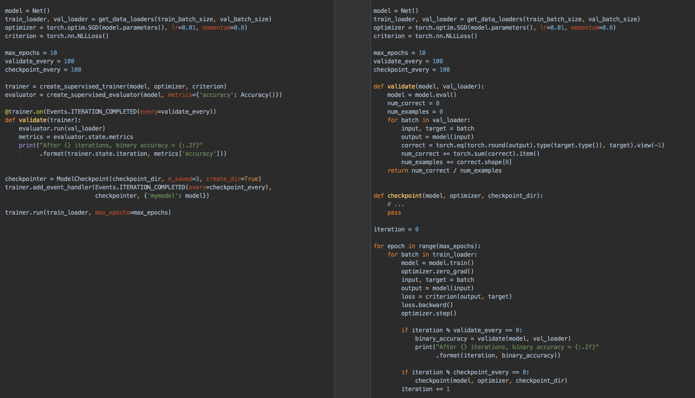

Ignite
======

.. image:: https://travis-ci.org/pytorch/ignite.svg?branch=master
    :target: https://travis-ci.org/pytorch/ignite

.. image:: https://codecov.io/gh/pytorch/ignite/branch/master/graph/badge.svg
    :target: https://codecov.io/gh/pytorch/ignite

.. image:: https://pepy.tech/badge/pytorch-ignite
    :target: https://pepy.tech/project/pytorch-ignite

.. image:: https://img.shields.io/badge/dynamic/json.svg?label=docs&url=https%3A%2F%2Fpypi.org%2Fpypi%2Fpytorch-ignite%2Fjson&query=%24.info.version&colorB=brightgreen&prefix=v
    :target: https://pytorch.org/ignite/index.html
    
Ignite is a high-level library to help with training neural networks in PyTorch.

- ignite helps you write compact but full-featured training loops in a few lines of code
- you get a training loop with metrics, early-stopping, model checkpointing and other features without the boilerplate

Below we show a side-by-side comparison of using pure pytorch and using ignite to create a training loop
to train and validate your model with occasional checkpointing:

As you can see, the code is more concise and readable with ignite. Furthermore, adding additional metrics, or
things like early stopping is a breeze in ignite, but can start to rapidly increase the complexity of
your code when "rolling your own" training loop.

Installation
============

From pip:

.. code:: bash

    pip install pytorch-ignite

From conda:

.. code:: bash

    conda install ignite -c pytorch

From source:

.. code:: bash

    python setup.py install

Documentation
=============
API documentation and an overview of the library can be found `here <https://pytorch.org/ignite/index.html>`_.

Examples
========
Please check out the `examples
<https://github.com/pytorch/ignite/tree/master/examples>`_ to see how to use `ignite` to train various types of networks, as well as how to use `visdom <https://github.com/facebookresearch/visdom>`_ or `tensorboardX <https://github.com/lanpa/tensorboard-pytorch>`_ for training visualizations.

Contributing
============
We appreciate all contributions. If you are planning to contribute back bug-fixes, please do so without any further discussion. If you plan to contribute new features, utility functions or extensions, please first open an issue and discuss the feature with us.

Please see the `contribution guidelines <https://github.com/pytorch/ignite/blob/master/CONTRIBUTING.md>`_ for more information.

As always, PRs are welcome :)

How does this compare to Torchnet?
==================================
Ignite, in spirit is very similar to `torchnet <https://github.com/pytorch/tnt>`_ (and was inspired by torchnet). 

The main differences with torchnet is the level of abstraction for the user. Ignite's higher level of abstraction assumes less about the type of network (or networks) that you are training, and we require the user to define the closure to be run in the training and validation loop. In contrast to this, torchnet creates this closure internally based on the network and optimizer you pass to it. This higher level of abstraction allows for a great deal more of flexibility, such as co-training multiple models (i.e. GANs) and computing/tracking multiple losses and metrics in your training loop.

Ignite also allows for multiple handlers to be attached to events, and a finer granularity of events in the engine loop.
