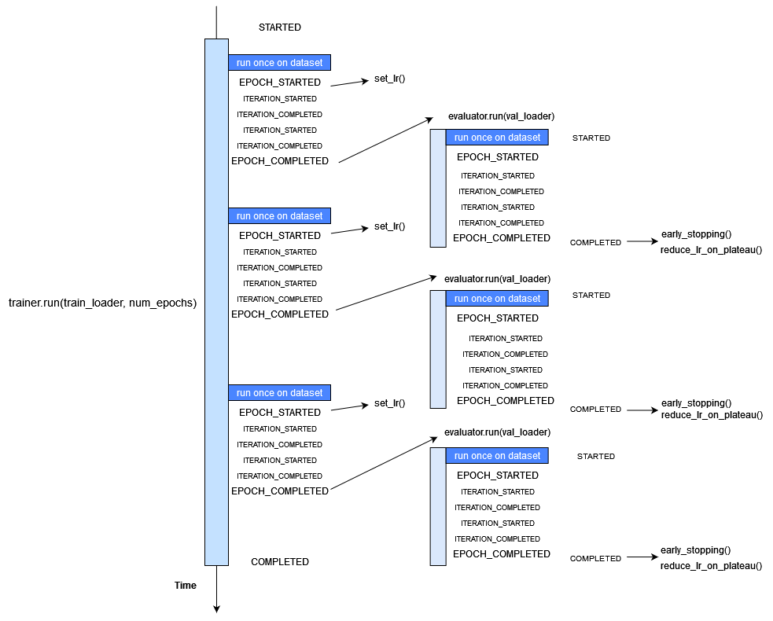

Concepts
========

Engine
------

The **essence** of the framework is the class :class:`~ignite.engine.Engine`, an abstraction that loops a given number of times over
provided data, executes a processing function and returns a result:

.. code-block:: python

    while epoch < max_epochs:
        # run an epoch on data
        data_iter = iter(data)
        while True:
            try:
                batch = next(data_iter)
                output = process_function(batch)
                iter_counter += 1
            except StopIteration:
                data_iter = iter(data)

            if iter_counter == epoch_length:
                break

Thus, a model trainer is simply an engine that loops multiple times over the training dataset and updates model parameters.
Similarly, model evaluation can be done with an engine that runs a single time over the validation dataset and computes metrics.
For example, model trainer for a supervised task:

.. code-block:: python

    def update_model(trainer, batch):
        model.train()
        optimizer.zero_grad()
        x, y = prepare_batch(batch)
        y_pred = model(x)
        loss = loss_fn(y_pred, y)
        loss.backward()
        optimizer.step()
        return loss.item()

    trainer = Engine(update_model)
    trainer.run(data, max_epochs=100)

.. Note ::

    By default, epoch length is defined by `len(data)`. However, user can also manually define the epoch length as a
    number of iterations to loop. In this way the input data can be an iterator.

    .. code-block:: python

        trainer.run(data, max_epochs=100, epoch_length=200)


Events and Handlers
-------------------

To improve the :class:`~ignite.engine.Engine`'s flexibility, an event system is introduced that facilitates interaction on each step of
the run:

- *engine is started/completed*
- *epoch is started/completed*
- *batch iteration is started/completed*

Complete list of events can be found at :class:`~ignite.engine.Events`.

Thus, user can execute a custom code as an event handler. Let us consider in more detail what happens when
:meth:`~ignite.engine.Engine.run` is called:

.. code-block:: python

    fire_event(Events.STARTED)
    while epoch < max_epochs:
        fire_event(Events.EPOCH_STARTED)
        # run once on data
        for batch in data:
            fire_event(Events.ITERATION_STARTED)

            output = process_function(batch)

            fire_event(Events.ITERATION_COMPLETED)
        fire_event(Events.EPOCH_COMPLETED)
    fire_event(Events.COMPLETED)

At first *engine is started* event is fired and all this event handlers are executed (we will see in the next paragraph
how to add event handlers). Next, `while` loop is started and *epoch is started* event occurs, etc. Every time
an event is "fired", attached handlers are executed.

Attaching an event handler is simple using method :meth:`~ignite.engine.Engine.add_event_handler` or
:meth:`~ignite.engine.Engine.on` decorator:

.. code-block:: python

    trainer = Engine(update_model)

    trainer.add_event_handler(Events.STARTED, lambda engine: print("Start training"))
    # or
    @trainer.on(Events.STARTED)
    def on_training_started(engine):
        print("Another message of start training")

    # attach handler with args, kwargs
    mydata = [1, 2, 3, 4]

    def on_training_ended(engine, data):
        print("Training is ended. mydata={}".format(data))

    trainer.add_event_handler(Events.COMPLETED, on_training_ended, mydata)

Event handlers can be detached via :meth:`~ignite.engine.Engine.remove_event_handler` or via the :class:`~ignite.engine.RemovableEventHandler`
reference returned by :meth:`~ignite.engine.Engine.add_event_handler`. This can be used to reuse a configured engine for multiple loops:

.. code-block:: python

    model = ...
    train_loader, validation_loader, test_loader = ...

    trainer = create_supervised_trainer(model, optimizer, loss)
    evaluator = create_supervised_evaluator(model, metrics={'acc': Accuracy()})

    def log_metrics(engine, title):
        print("Epoch: {} - {} accuracy: {:.2f}"
               .format(trainer.state.epoch, title, engine.state.metrics['acc']))

    @trainer.on(Events.EPOCH_COMPLETED)
    def evaluate(trainer):
        with evaluator.add_event_handler(Events.COMPLETED, log_metrics, "train"):
            evaluator.run(train_loader)

        with evaluator.add_event_handler(Events.COMPLETED, log_metrics, "validation"):
            evaluator.run(validation_loader)

        with evaluator.add_event_handler(Events.COMPLETED, log_metrics, "test"):
            evaluator.run(test_loader)

    trainer.run(train_loader, max_epochs=100)


Event handlers can be also configured to be called with a user pattern: every n-th events, once or using a custom
event filtering function:

.. code-block:: python

    model = ...
    train_loader, validation_loader, test_loader = ...

    trainer = create_supervised_trainer(model, optimizer, loss)

    @trainer.on(Events.ITERATION_COMPLETED(every=50))
    def log_training_loss_every_50_iterations(engine):
        print("{} / {} : {} - loss: {:.2f}"
              .format(engine.state.epoch, engine.state.max_epochs, engine.state.iteration, engine.state.output))

    @trainer.on(Events.EPOCH_STARTED(once=25))
    def do_something_once_on_25_epoch(engine):
        # do something

    def custom_event_filter(engine, event):
        if event in [1, 2, 5, 10, 50, 100]:
            return True
        return False

    @engine.on(Events.ITERATION_STARTED(event_filter=custom_event_filter))
    def call_on_special_event(engine):
         # do something on 1, 2, 5, 10, 50, 100 iterations

    trainer.run(train_loader, max_epochs=100)


.. Note ::

   User can also register custom events with :meth:`~ignite.engine.Engine.register_events`, attach handlers and fire custom events
   calling :meth:`~ignite.engine.Engine.fire_event` in any handler or `process_function`.

   See the source code of :class:`~ignite.contrib.engines.create_supervised_tbptt_trainer` for an example of usage of
   custom events.


Timeline and events
```````````````````

Below the events and some typical handlers are displayed on a timeline for a training loop with evaluation after every
epoch:



State
-----
A state is introduced in :class:`~ignite.engine.Engine` to store the output of the `process_function`, current epoch,
iteration and other helpful information. Each :class:`~ignite.engine.Engine` contains a :class:`~ignite.engine.State`, 
which includes the following:

- **engine.state.seed**: Seed to set at each data "epoch".
- **engine.state.epoch**: Number of epochs the engine has completed. Initializated as 0 and the first epoch is 1.
- **engine.state.iteration**: Number of iterations the engine has completed. Initialized as 0 and the first iteration is 1.
- **engine.state.max_epochs**: Number of epochs to run for. Initializated as 1.
- **engine.state.output**: The output of the `process_function` defined for the :class:`~ignite.engine.Engine`. See below.
- etc

Other attributes can be found in the docs of :class:`~ignite.engine.State`.

In the code below, `engine.state.output` will store the batch loss. This output is used to print the loss at 
every iteration.

.. code-block:: python

    def update(engine, batch):
        x, y = batch
        y_pred = model(inputs)
        loss = loss_fn(y_pred, y)
        optimizer.zero_grad()
        loss.backward()
        optimizer.step()
        return loss.item()

    def on_iteration_completed(engine):
        iteration = engine.state.iteration
        epoch = engine.state.epoch
        loss = engine.state.output
        print("Epoch: {}, Iteration: {}, Loss: {}".format(epoch, iteration, loss))

    trainer.add_event_handler(Events.ITERATION_COMPLETED, on_iteration_completed)

Since there is no restrictions on the output of `process_function`, Ignite provides `output_transform` argument for its
:class:`~ignite.metrics` and :class:`~ignite.handlers`. Argument `output_transform` is a function used to transform `engine.state.output` for intended use. Below we'll see different types of `engine.state.output` and how to transform them.

In the code below, `engine.state.output` will be a list of loss, y_pred, y for the processed batch. If we want to attach :class:`~ignite.metrics.Accuracy` to the engine, `output_transform` will be needed to get y_pred and y from
`engine.state.output`. Let's see how that is done:

.. code-block:: python

    def update(engine, batch):
        x, y = batch
        y_pred = model(inputs)
        loss = loss_fn(y_pred, y)
        optimizer.zero_grad()
        loss.backward()
        optimizer.step()
        return loss.item(), y_pred, y

    trainer = Engine(update)

    @trainer.on(Events.EPOCH_COMPLETED)
    def print_loss(engine):
        epoch = engine.state.epoch
        loss = engine.state.output[0]
        print ('Epoch {epoch}: train_loss = {loss}'.format(epoch=epoch, loss=loss))

    accuracy = Accuracy(output_transform=lambda x: [x[1], x[2]])
    accuracy.attach(trainer, 'acc')
    trainer.run(data, max_epochs=10)

Similar to above, but this time the output of the `process_function` is a dictionary of loss, y_pred, y for the processed
batch, this is how the user can use `output_transform` to get y_pred and y from `engine.state.output`. See below:

.. code-block:: python

    def update(engine, batch):
        x, y = batch
        y_pred = model(inputs)
        loss = loss_fn(y_pred, y)
        optimizer.zero_grad()
        loss.backward()
        optimizer.step()
        return {'loss': loss.item(),
                'y_pred': y_pred,
                'y': y}

    trainer = Engine(update)

    @trainer.on(Events.EPOCH_COMPLETED)
    def print_loss(engine):
        epoch = engine.state.epoch
        loss = engine.state.output['loss']
        print ('Epoch {epoch}: train_loss = {loss}'.format(epoch=epoch, loss=loss))

    accuracy = Accuracy(output_transform=lambda x: [x['y_pred'], x['y']])
    accuracy.attach(trainer, 'acc')
    trainer.run(data, max_epochs=10)

.. Note ::

   A good practice is to use :class:`~ignite.engine.State` also as a storage of user data created in update or handler functions.
   For example, we would like to save `new_attribute` in the `state`:

   .. code-block:: python

      def user_handler_function(engine):
          engine.state.new_attribute = 12345


Resume training
---------------

Engine provides two methods to serialize and deserialize its internal state :meth:`~ignite.engine.Engine.state_dict` and
:meth:`~ignite.engine.Engine.load_state_dict`. In addition
with serializing model, optimizer, lr scheduler etc user can store the trainer and then resume the training from
an **iteration**. For example, using :class:`~ignite.handlers.Checkpoint` handler we can easily save checkpoints
containing serialized trainer, model, optimizer, etc

.. code-block:: python

    from ignite.engine import Engine, Events
    from ignite.handlers import Checkpoint, DiskSaver

    trainer = ...
    model = ...
    optimizer = ...
    lr_scheduler = ...
    data_loader = ...

    to_save = {'trainer': trainer, 'model': model, 'optimizer': optimizer, 'lr_scheduler': lr_scheduler}
    handler = Checkpoint(to_save, DiskSaver('/tmp/training', create_dir=True))
    trainer.add_event_handler(Events.ITERATION_COMPLETED(every=1000), handler)
    trainer.run(data_loader, max_epochs=100)

.. code-block:: bash

    ls /tmp/training
    > "checkpoint_50000.pth"

We can then restore the training from the last checkpoint.

.. code-block:: python

    from ignite.handlers import Checkpoint

    trainer = ...
    model = ...
    optimizer = ...
    lr_scheduler = ...
    data_loader = ...

    to_load = {'trainer': trainer, 'model': model, 'optimizer': optimizer, 'lr_scheduler': lr_scheduler}
    checkpoint = torch.load(checkpoint_file)
    Checkpoint.load_objects(to_load=to_load, checkpoint=checkpoint)

    trainer.run(train_loader, max_epochs=100)

Please, note that trainer can continue the training from the checkpoint iteration.
In case when input data is `torch.utils.data.DataLoader`, previous batches are skipped and the first provided batch
corresponds to the batch after the checkpoint iteration. Internally, while resuming, previous datapoint indices are just
skipped without fetching the data.

.. warning::

    However, while resuming from iteration, random data augmentations are not synchronized in the middle of the epoch and
    thus batches remaining until the end of en epoch can effectively be different of those from the initial run.


Complete examples that simulates a crash on a defined iteration and resumes the training from a checkpoint can be found
here:

- `save/resume MNIST <https://github.com/pytorch/ignite/tree/master/examples/mnist#training-save--resume>`_
- `save/resume Distributed CIFAR10 <https://github.com/pytorch/ignite/tree/engine_refactor/examples/contrib/cifar10#check-resume-training>`_


