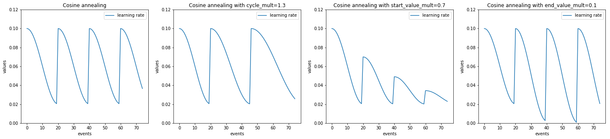
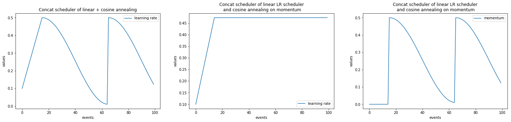
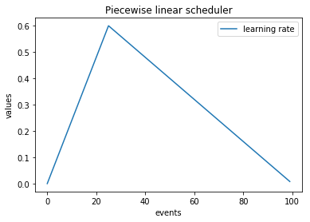
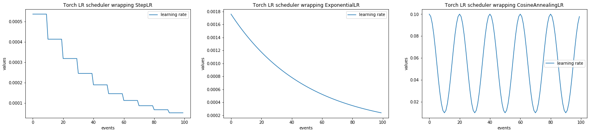

ignite.contrib.handlers
=======================

Contribution module of handlers

.. currentmodule:: ignite.contrib.handlers

.. automodule:: ignite.contrib.handlers
   :members:
   :undoc-members:
   :imported-members:


More on parameter scheduling
----------------------------

In this section there are visual examples of various parameter schedulings that can be achieved.


Example with :class:`ignite.contrib.handlers.CosineAnnealingScheduler`
``````````````````````````````````````````````````````````````````````

.. code-block:: python

    import numpy as np
    import matplotlib.pylab as plt
    from ignite.contrib.handlers import CosineAnnealingScheduler

    lr_values_1 = np.array(CosineAnnealingScheduler.simulate_values(num_events=75, param_name='lr',
                                                                start_value=1e-1, end_value=2e-2, cycle_size=20))

    lr_values_2 = np.array(CosineAnnealingScheduler.simulate_values(num_events=75, param_name='lr',
                                                                    start_value=1e-1, end_value=2e-2, cycle_size=20, cycle_mult=1.3))

    lr_values_3 = np.array(CosineAnnealingScheduler.simulate_values(num_events=75, param_name='lr',
                                                                    start_value=1e-1, end_value=2e-2,
                                                                    cycle_size=20, start_value_mult=0.7))

    lr_values_4 = np.array(CosineAnnealingScheduler.simulate_values(num_events=75, param_name='lr',
                                                                    start_value=1e-1, end_value=2e-2,
                                                                    cycle_size=20, end_value_mult=0.1))


    plt.figure(figsize=(25, 5))

    plt.subplot(141)
    plt.title("Cosine annealing")
    plt.plot(lr_values_1[:, 0], lr_values_1[:, 1], label="learning rate")
    plt.xlabel("events")
    plt.ylabel("values")
    plt.legend()
    plt.ylim([0.0, 0.12])

    plt.subplot(142)
    plt.title("Cosine annealing with cycle_mult=1.3")
    plt.plot(lr_values_2[:, 0], lr_values_2[:, 1], label="learning rate")
    plt.xlabel("events")
    plt.ylabel("values")
    plt.legend()
    plt.ylim([0.0, 0.12])

    plt.subplot(143)
    plt.title("Cosine annealing with start_value_mult=0.7")
    plt.plot(lr_values_3[:, 0], lr_values_3[:, 1], label="learning rate")
    plt.xlabel("events")
    plt.ylabel("values")
    plt.legend()
    plt.ylim([0.0, 0.12])

    plt.subplot(144)
    plt.title("Cosine annealing with end_value_mult=0.1")
    plt.plot(lr_values_4[:, 0], lr_values_4[:, 1], label="learning rate")
    plt.xlabel("events")
    plt.ylabel("values")
    plt.legend()
    plt.ylim([0.0, 0.12])





Example with :class:`ignite.contrib.handlers.LinearCyclicalScheduler`
`````````````````````````````````````````````````````````````````````

.. code-block:: python

    import numpy as np
    import matplotlib.pylab as plt
    from ignite.contrib.handlers import LinearCyclicalScheduler

    lr_values_1 = np.array(LinearCyclicalScheduler.simulate_values(num_events=75, param_name='lr',
                                                                    start_value=1e-1, end_value=2e-2, cycle_size=20))

    lr_values_2 = np.array(LinearCyclicalScheduler.simulate_values(num_events=75, param_name='lr',
                                                                    start_value=1e-1, end_value=2e-2, cycle_size=20, cycle_mult=1.3))

    lr_values_3 = np.array(LinearCyclicalScheduler.simulate_values(num_events=75, param_name='lr',
                                                                    start_value=1e-1, end_value=2e-2,
                                                                    cycle_size=20, start_value_mult=0.7))

    lr_values_4 = np.array(LinearCyclicalScheduler.simulate_values(num_events=75, param_name='lr',
                                                                    start_value=1e-1, end_value=2e-2,
                                                                    cycle_size=20, end_value_mult=0.1))


    plt.figure(figsize=(25, 5))

    plt.subplot(141)
    plt.title("Linear cyclical scheduler")
    plt.plot(lr_values_1[:, 0], lr_values_1[:, 1], label="learning rate")
    plt.xlabel("events")
    plt.ylabel("values")
    plt.legend()
    plt.ylim([0.0, 0.12])

    plt.subplot(142)
    plt.title("Linear cyclical scheduler with cycle_mult=1.3")
    plt.plot(lr_values_2[:, 0], lr_values_2[:, 1], label="learning rate")
    plt.xlabel("events")
    plt.ylabel("values")
    plt.legend()
    plt.ylim([0.0, 0.12])

    plt.subplot(143)
    plt.title("Linear cyclical scheduler with start_value_mult=0.7")
    plt.plot(lr_values_3[:, 0], lr_values_3[:, 1], label="learning rate")
    plt.xlabel("events")
    plt.ylabel("values")
    plt.legend()
    plt.ylim([0.0, 0.12])

    plt.subplot(144)
    plt.title("Linear cyclical scheduler with end_value_mult=0.1")
    plt.plot(lr_values_4[:, 0], lr_values_4[:, 1], label="learning rate")
    plt.xlabel("events")
    plt.ylabel("values")
    plt.legend()
    plt.ylim([0.0, 0.12])


.. image:: ../_static/img/schedulers/linear_cyclical_example.png


Example with :class:`ignite.contrib.handlers.ConcatScheduler`
`````````````````````````````````````````````````````````````

.. code-block:: python

    import numpy as np
    import matplotlib.pylab as plt
    from ignite.contrib.handlers import LinearCyclicalScheduler, CosineAnnealingScheduler, ConcatScheduler

    import torch

    t1 = torch.zeros([1], requires_grad=True)
    optimizer = torch.optim.SGD([t1], lr=0.1)


    scheduler_1 = LinearCyclicalScheduler(optimizer, "lr", start_value=0.1, end_value=0.5, cycle_size=30)
    scheduler_2 = CosineAnnealingScheduler(optimizer, "lr", start_value=0.5, end_value=0.01, cycle_size=50)
    durations = [15, ]

    lr_values_1 = np.array(ConcatScheduler.simulate_values(num_events=100, schedulers=[scheduler_1, scheduler_2], durations=durations))


    t1 = torch.zeros([1], requires_grad=True)
    optimizer = torch.optim.SGD([t1], lr=0.1)

    scheduler_1 = LinearCyclicalScheduler(optimizer, "lr", start_value=0.1, end_value=0.5, cycle_size=30)
    scheduler_2 = CosineAnnealingScheduler(optimizer, "momentum", start_value=0.5, end_value=0.01, cycle_size=50)
    durations = [15, ]

    lr_values_2 = np.array(ConcatScheduler.simulate_values(num_events=100, schedulers=[scheduler_1, scheduler_2], durations=durations,
                                                            param_names=["lr", "momentum"]))

    plt.figure(figsize=(25, 5))

    plt.subplot(131)
    plt.title("Concat scheduler of linear + cosine annealing")
    plt.plot(lr_values_1[:, 0], lr_values_1[:, 1], label="learning rate")
    plt.xlabel("events")
    plt.ylabel("values")
    plt.legend()

    plt.subplot(132)
    plt.title("Concat scheduler of linear LR scheduler\n and cosine annealing on momentum")
    plt.plot(lr_values_2[:, 0], lr_values_2[:, 1], label="learning rate")
    plt.xlabel("events")
    plt.ylabel("values")
    plt.legend()

    plt.subplot(133)
    plt.title("Concat scheduler of linear LR scheduler\n and cosine annealing on momentum")
    plt.plot(lr_values_2[:, 0], lr_values_2[:, 2], label="momentum")
    plt.xlabel("events")
    plt.ylabel("values")
    plt.legend()



Piecewise linear scheduler
^^^^^^^^^^^^^^^^^^^^^^^^^^

.. code-block:: python

    import numpy as np
    import matplotlib.pylab as plt
    from ignite.contrib.handlers import LinearCyclicalScheduler, ConcatScheduler

    scheduler_1 = LinearCyclicalScheduler(optimizer, "lr", start_value=0.0, end_value=0.6, cycle_size=50)
    scheduler_2 = LinearCyclicalScheduler(optimizer, "lr", start_value=0.6, end_value=0.0, cycle_size=150)
    durations = [25, ]

    lr_values = np.array(ConcatScheduler.simulate_values(num_events=100, schedulers=[scheduler_1, scheduler_2], durations=durations))


    plt.title("Piecewise linear scheduler")
    plt.plot(lr_values[:, 0], lr_values[:, 1], label="learning rate")
    plt.xlabel("events")
    plt.ylabel("values")
    plt.legend()




Example with :class:`ignite.contrib.handlers.LRScheduler`
`````````````````````````````````````````````````````````

.. code-block:: python

    import numpy as np
    import matplotlib.pylab as plt
    from ignite.contrib.handlers import LRScheduler

    import torch
    from torch.optim.lr_scheduler import ExponentialLR, StepLR, CosineAnnealingLR

    tensor = torch.zeros([1], requires_grad=True)
    optimizer = torch.optim.SGD([tensor], lr=0.1)

    lr_scheduler_1 = StepLR(optimizer=optimizer, step_size=10, gamma=0.77)
    lr_scheduler_2 = ExponentialLR(optimizer=optimizer, gamma=0.98)
    lr_scheduler_3 = CosineAnnealingLR(optimizer=optimizer, T_max=10, eta_min=0.01)

    lr_values_1 = np.array(LRScheduler.simulate_values(num_events=100, lr_scheduler=lr_scheduler_1))
    lr_values_2 = np.array(LRScheduler.simulate_values(num_events=100, lr_scheduler=lr_scheduler_2))
    lr_values_3 = np.array(LRScheduler.simulate_values(num_events=100, lr_scheduler=lr_scheduler_3))


    plt.figure(figsize=(25, 5))

    plt.subplot(131)
    plt.title("Torch LR scheduler wrapping StepLR")
    plt.plot(lr_values_1[:, 0], lr_values_1[:, 1], label="learning rate")
    plt.xlabel("events")
    plt.ylabel("values")
    plt.legend()

    plt.subplot(132)
    plt.title("Torch LR scheduler wrapping ExponentialLR")
    plt.plot(lr_values_2[:, 0], lr_values_2[:, 1], label="learning rate")
    plt.xlabel("events")
    plt.ylabel("values")
    plt.legend()

    plt.subplot(133)
    plt.title("Torch LR scheduler wrapping CosineAnnealingLR")
    plt.plot(lr_values_3[:, 0], lr_values_3[:, 1], label="learning rate")
    plt.xlabel("events")
    plt.ylabel("values")
    plt.legend()





Concatenate with torch schedulers
^^^^^^^^^^^^^^^^^^^^^^^^^^^^^^^^^

.. code-block:: python

    import numpy as np
    import matplotlib.pylab as plt
    from ignite.contrib.handlers import LRScheduler, ConcatScheduler

    import torch
    from torch.optim.lr_scheduler import ExponentialLR, StepLR

    t1 = torch.zeros([1], requires_grad=True)
    optimizer = torch.optim.SGD([t1], lr=0.1)

    scheduler_1 = LinearCyclicalScheduler(optimizer, "lr", start_value=0.001, end_value=0.1, cycle_size=30)
    lr_scheduler = ExponentialLR(optimizer=optimizer, gamma=0.7)
    scheduler_2 = LRScheduler(lr_scheduler=lr_scheduler)
    durations = [15, ]
    lr_values_1 = np.array(ConcatScheduler.simulate_values(num_events=30, schedulers=[scheduler_1, scheduler_2], durations=durations))


    scheduler_1 = LinearCyclicalScheduler(optimizer, "lr", start_value=0.001, end_value=0.1, cycle_size=30)
    lr_scheduler = StepLR(optimizer=optimizer, step_size=10, gamma=0.7)
    scheduler_2 = LRScheduler(lr_scheduler=lr_scheduler)
    durations = [15, ]
    lr_values_2 = np.array(ConcatScheduler.simulate_values(num_events=75, schedulers=[scheduler_1, scheduler_2], durations=durations))

    plt.figure(figsize=(15, 5))
    plt.subplot(121)
    plt.title("Concat scheduler of linear + ExponentialLR")
    plt.plot(lr_values_1[:, 0], lr_values_1[:, 1], label="learning rate")
    plt.xlabel("events")
    plt.ylabel("values")
    plt.legend()

    plt.subplot(122)
    plt.title("Concat scheduler of linear + StepLR")
    plt.plot(lr_values_2[:, 0], lr_values_2[:, 1], label="learning rate")
    plt.xlabel("events")
    plt.ylabel("values")
    plt.legend()


.. image:: ../_static/img/schedulers/concat_linear_exp_step_lr.png

