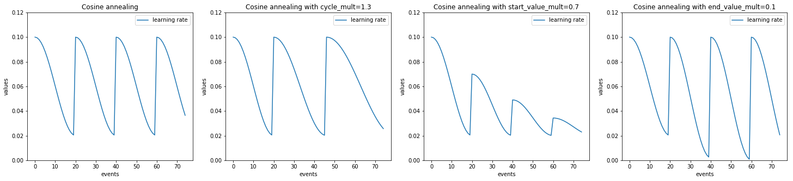
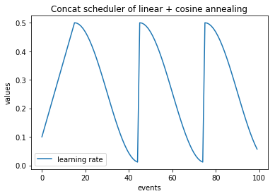

ignite.contrib.handlers
=======================

Contribution module of handlers

.. currentmodule:: ignite.contrib.handlers

.. automodule:: ignite.contrib.handlers
   :members:
   :undoc-members:
   :imported-members:


More on parameter scheduling
----------------------------

In this section there are visual examples of various parameter schedulings that can be achieved.


Example with :class:`ignite.contrib.handlers.CosineAnnealingScheduler`
```````````````````````````````````````````````````````````````````````

.. code-block:: python

    import numpy as np
    import matplotlib.pylab as plt
    from ignite.contrib.handlers import CosineAnnealingScheduler

    lr_values_1 = np.array(CosineAnnealingScheduler.simulate_values(num_events=75, param_name='lr',
                                                                start_value=1e-1, end_value=2e-2, cycle_size=20))

    lr_values_2 = np.array(CosineAnnealingScheduler.simulate_values(num_events=75, param_name='lr',
                                                                    start_value=1e-1, end_value=2e-2, cycle_size=20, cycle_mult=1.3))

    lr_values_3 = np.array(CosineAnnealingScheduler.simulate_values(num_events=75, param_name='lr',
                                                                    start_value=1e-1, end_value=2e-2,
                                                                    cycle_size=20, start_value_mult=0.7))

    lr_values_4 = np.array(CosineAnnealingScheduler.simulate_values(num_events=75, param_name='lr',
                                                                    start_value=1e-1, end_value=2e-2,
                                                                    cycle_size=20, end_value_mult=0.1))


    plt.figure(figsize=(25, 5))

    plt.subplot(141)
    plt.title("Cosine annealing")
    plt.plot(lr_values_1[:, 0], lr_values_1[:, 1], label="learning rate")
    plt.xlabel("events")
    plt.ylabel("values")
    plt.legend()
    plt.ylim([0.0, 0.12])

    plt.subplot(142)
    plt.title("Cosine annealing with cycle_mult=1.3")
    plt.plot(lr_values_2[:, 0], lr_values_2[:, 1], label="learning rate")
    plt.xlabel("events")
    plt.ylabel("values")
    plt.legend()
    plt.ylim([0.0, 0.12])

    plt.subplot(143)
    plt.title("Cosine annealing with start_value_mult=0.7")
    plt.plot(lr_values_3[:, 0], lr_values_3[:, 1], label="learning rate")
    plt.xlabel("events")
    plt.ylabel("values")
    plt.legend()
    plt.ylim([0.0, 0.12])

    plt.subplot(144)
    plt.title("Cosine annealing with end_value_mult=0.1")
    plt.plot(lr_values_4[:, 0], lr_values_4[:, 1], label="learning rate")
    plt.xlabel("events")
    plt.ylabel("values")
    plt.legend()
    plt.ylim([0.0, 0.12])





Example with :class:`ignite.contrib.handlers.LinearCyclicalScheduler`
`````````````````````````````````````````````````````````````````````

.. code-block:: python

    import numpy as np
    import matplotlib.pylab as plt
    from ignite.contrib.handlers import LinearCyclicalScheduler

    lr_values_1 = np.array(LinearCyclicalScheduler.simulate_values(num_events=75, param_name='lr',
                                                                    start_value=1e-1, end_value=2e-2, cycle_size=20))

    lr_values_2 = np.array(LinearCyclicalScheduler.simulate_values(num_events=75, param_name='lr',
                                                                    start_value=1e-1, end_value=2e-2, cycle_size=20, cycle_mult=1.3))

    lr_values_3 = np.array(LinearCyclicalScheduler.simulate_values(num_events=75, param_name='lr',
                                                                    start_value=1e-1, end_value=2e-2,
                                                                    cycle_size=20, start_value_mult=0.7))

    lr_values_4 = np.array(LinearCyclicalScheduler.simulate_values(num_events=75, param_name='lr',
                                                                    start_value=1e-1, end_value=2e-2,
                                                                    cycle_size=20, end_value_mult=0.1))


    plt.figure(figsize=(25, 5))

    plt.subplot(141)
    plt.title("Linear cyclical scheduler")
    plt.plot(lr_values_1[:, 0], lr_values_1[:, 1], label="learning rate")
    plt.xlabel("events")
    plt.ylabel("values")
    plt.legend()
    plt.ylim([0.0, 0.12])

    plt.subplot(142)
    plt.title("Linear cyclical scheduler with cycle_mult=1.3")
    plt.plot(lr_values_2[:, 0], lr_values_2[:, 1], label="learning rate")
    plt.xlabel("events")
    plt.ylabel("values")
    plt.legend()
    plt.ylim([0.0, 0.12])

    plt.subplot(143)
    plt.title("Linear cyclical scheduler with start_value_mult=0.7")
    plt.plot(lr_values_3[:, 0], lr_values_3[:, 1], label="learning rate")
    plt.xlabel("events")
    plt.ylabel("values")
    plt.legend()
    plt.ylim([0.0, 0.12])

    plt.subplot(144)
    plt.title("Linear cyclical scheduler with end_value_mult=0.1")
    plt.plot(lr_values_4[:, 0], lr_values_4[:, 1], label="learning rate")
    plt.xlabel("events")
    plt.ylabel("values")
    plt.legend()
    plt.ylim([0.0, 0.12])


.. image:: ../_static/img/linear_cyclical_example.png


Example with :class:`ignite.contrib.handlers.ConcatScheduler`
`````````````````````````````````````````````````````````````

.. code-block:: python

    import numpy as np
    import matplotlib.pylab as plt
    from ignite.contrib.handlers import LinearCyclicalScheduler, CosineAnnealingScheduler, ConcatScheduler

    scheduler_1_def = (
        LinearCyclicalScheduler,
        dict(
            start_value=0.1,
            end_value=0.5,
            cycle_size=30
        ),
        15
    )

    scheduler_2_def = (
        CosineAnnealingScheduler,
        dict(
            start_value=0.5,
            end_value=0.01,
            cycle_size=30
        ),
        None
    )


    lr_values = np.array(ConcatScheduler.simulate_values(num_events=100, param_name="lr", schedulers_list=[scheduler_1_def, scheduler_2_def]))

    plt.title("Concat scheduler of linear + cosine annealing")
    plt.plot(lr_values[:, 0], lr_values[:, 1], label="learning rate")
    plt.xlabel("events")
    plt.ylabel("values")
    plt.legend()


