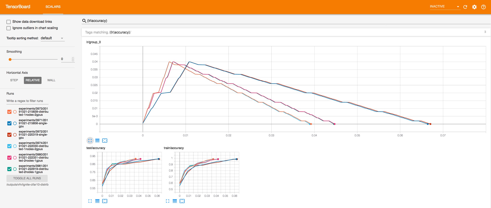
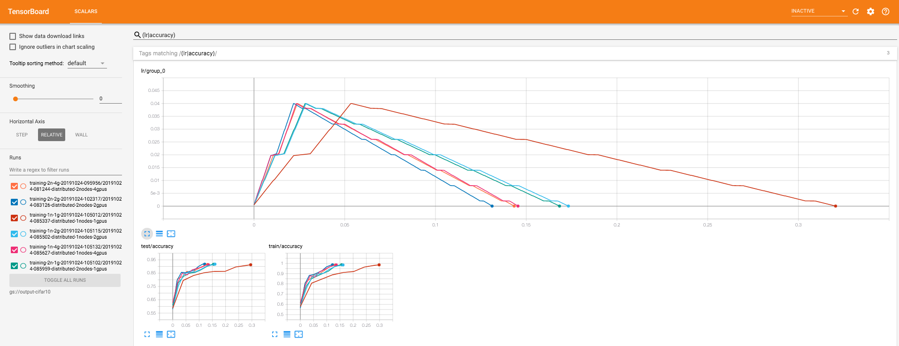
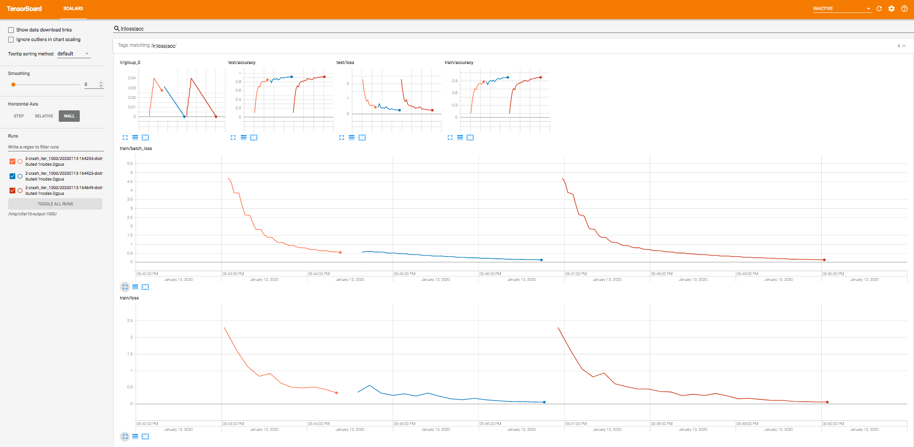
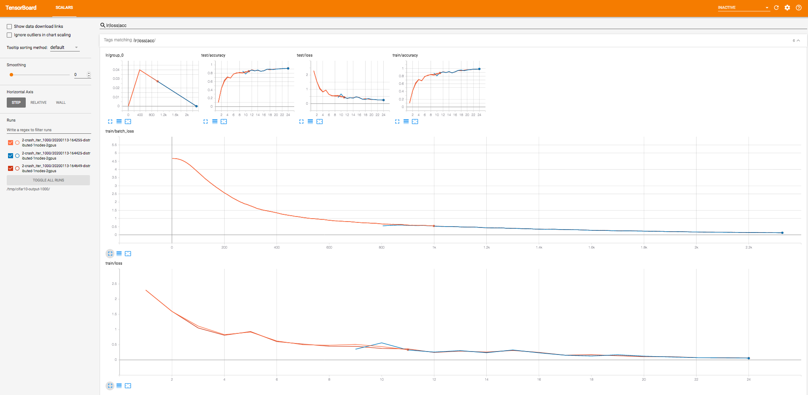

# CIFAR10 Example with Ignite

In this example, we show how to use *Ignite* to train a neural network on 1 or more GPUs, save the best model weights, 
log learning rate, training/validation metrics.

Configurations:

* [x] single GPU
* [x] multi GPUs on a single node
* [x] multi GPUs on multiple nodes

## Requirements:

- [torchvision](https://github.com/pytorch/vision/): `pip install torchvision`
- [tqdm](https://github.com/tqdm/tqdm/): `pip install tqdm`
- [tensorboardx](https://github.com/lanpa/tensorboard-pytorch): `pip install tensorboardX`

## Usage:

Run the example on a single GPU (script will not run without a GPU):
```bash
python main.py
```

If user would like to provide already downloaded dataset, the path can be setup in parameters as
```bash
--params="data_path=/path/to/cifar10/"
```


### Distributed training

#### Single node, multiple GPUs

Let's start training on a single node with 2 gpus:
```bash
python -u -m torch.distributed.launch --nproc_per_node=2 main.py --params="batch_size=512;dist_backend='nccl';output_path=/tmp/output"
```

If user would like to provide already downloaded dataset, the path can be setup in parameters as
```bash
--params="data_path=/path/to/cifar10/;batch_size=512"
```




#### Multiple nodes, multiple GPUs

Let's start training on two nodes with 2 gpus each. We assuming that master node can be connected as `master`, e.g. `ping master`.

1) Execute on master node
```bash
python -u -m torch.distributed.launch \
    --nnodes=2 \
    --nproc_per_node=2 \
    --node_rank=0 \
    --master_addr=master --master_port=2222 \
    main.py --params="batch_size=512;dist_backend='nccl';output_path=/tmp/output"
```

2) Execute on worker node
```bash
python -u -m torch.distributed.launch \
    --nnodes=2 \
    --nproc_per_node=2 \
    --node_rank=1 \
    --master_addr=master --master_port=2222 \
    main.py --params="batch_size=512;dist_backend='nccl';output_path=/tmp/output"
```



## Reproduce trainings

- To reproduce trainings with [Polyaxon](https://polyaxon.com/), please see [plx_configs/README.md](plx_configs/README.md)
- To reproduce trainings on [GCP AI platform](https://cloud.google.com/ml-engine/docs/), please see [gcp_ai_platform](gcp_ai_platform/README.md).

## Acknowledgements

In this repository we are using the code from 
- [cifar10-fast repository](https://github.com/davidcpage/cifar10-fast)

Thanks to the authors for sharing their code!


## Check resume training

### Single GPU

Initial training with a crash at 1000 iteration (~10 epochs)
```bash
python main.py --params="data_path=/path/to/cifar10;crash_iteration=1000"
```

Resume from the latest checkpoint
```bash
python main.py --params="data_path=/path/to/cifar10;resume_from=/tmp/cifar10-output/XYZ-single-gpu/training_checkpoint_800.pth"
```

Training without crashing
```bash
python main.py --params="data_path=/path/to/cifar10"
```

### Single Node, multiple GPUs

Initial training with a crash at 1000 iteration (~10 epochs)
```bash
python -u -m torch.distributed.launch --nproc_per_node=2 main.py --params="batch_size=512;dist_backend='nccl';output_path=/tmp/cifar10-output;crash_iteration=1000"
```

Resume from the latest checkpoint
```bash
python -u -m torch.distributed.launch --nproc_per_node=2 main.py --params="batch_size=512;dist_backend='nccl';output_path=/tmp/cifar10-output;resume_from=/tmp/cifar10-output/XYZ--distributed-1nodes-2gpus/training_checkpoint_800.pth"
```

Training without crashing
```bash
python -u -m torch.distributed.launch --nproc_per_node=2 main.py --params="batch_size=512;dist_backend='nccl';output_path=/tmp/cifar10-output"
```



- Orange curves represent the training with a crash at the iteration 1000
- Blue curves show resumed training from the last checkpoint (iteration 800)
- Red curves display complete training without crashing  

**Note 1:** We can observe a gap on `train/batch_loss` curve between intial training and resumed training. This metric is 
computed as a running average and while resuming the training, the cumulative part is not restored.

**Note 2:** As we are resuming the training from an iteration between epochs, even if Ignite's engine handles the dataflow by
correctly providing data samples for the resumed iteration, random data augmentations are not synchronized. This causes a gap  
in validation curves (`train/loss`, `train/accuracy` etc.) at the begining of training resuming. 
  
