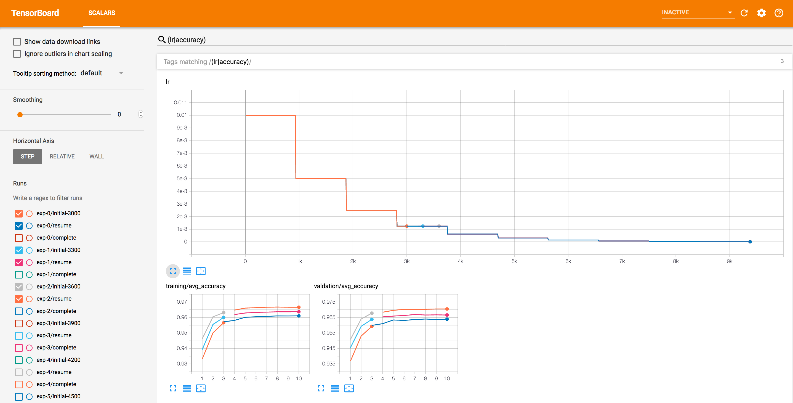
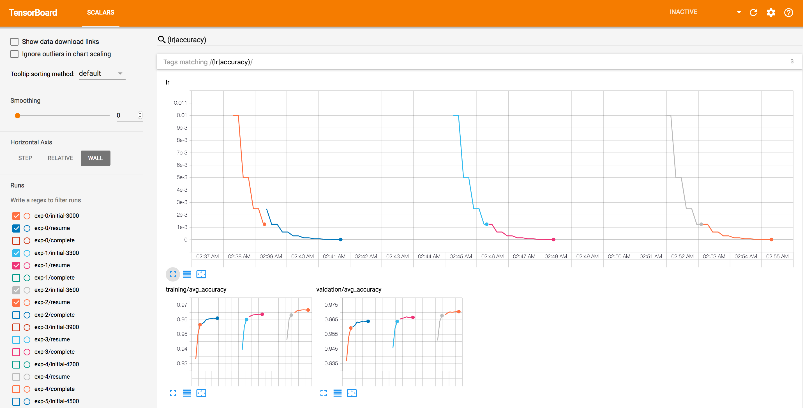

# Basic MNIST Example with Ignite

ported from [pytorch-examples](https://github.com/pytorch/examples/tree/master/mnist)

#### Requirements:

- [torchvision](https://github.com/pytorch/vision/): `pip install torchvision`
- [tqdm](https://github.com/tqdm/tqdm/): `pip install tqdm`

#### Usage:

Run the example:
```
python mnist.py
```

### Logging with TensorboardX

MNIST example with training and validation monitoring using TensorboardX and Tensorboard.

#### Requirements:

- [torchvision](https://github.com/pytorch/vision/): `pip install torchvision`
- [TensorboardX](https://github.com/lanpa/tensorboard-pytorch): `pip install tensorboardX`
- Tensorboard: `pip install tensorboard`

#### Usage:

Run the example:
```bash
python mnist_with_tensorboardx.py --log_dir=/tmp/tensorboard_logs
```

Start tensorboard:
```bash
tensorboard --logdir=/tmp/tensorboard_logs/
```

### Logging with Visdom

MNIST example with training and validation monitoring using Visdom

#### Requirements:

- [torchvision](https://github.com/pytorch/vision/): `pip install torchvision`
- [Visdom](https://github.com/facebookresearch/visdom): `pip install visdom`

#### Usage:

Start visdom:
```bash
python -m visdom.server
```

Run the example:
```bash
python mnist_with_visdom.py
```


### Training save & resume

Example shows how to save a checkpoint of the trainer, model, optimizer, lr scheduler. Training crash is emulated 
and user can resume the training from the latest checkpoint.
 
#### Requirements:

- [torchvision](https://github.com/pytorch/vision/): `pip install torchvision`
- [tqdm](https://github.com/tqdm/tqdm/): `pip install tqdm`
- [TensorboardX](https://github.com/lanpa/tensorboard-pytorch): `pip install tensorboardX`
- Tensorboard: `pip install tensorboard`

#### Usage:

Initial training with a crash
```bash
python mnist_save_resume_engine.py
```

Resume from the latest checkpoint
```bash
python mnist_save_resume_engine.py --resume_from /tmp/mnist_save_resume/checkpoint_<N>.pth
```

Training without crashing
```bash
python mnist_save_resume_engine.py --crash_iteration 100000
```

Start tensorboard:
```bash
tensorboard --logdir=/tmp/mnist_save_resume/
```



