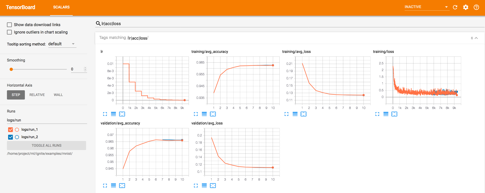
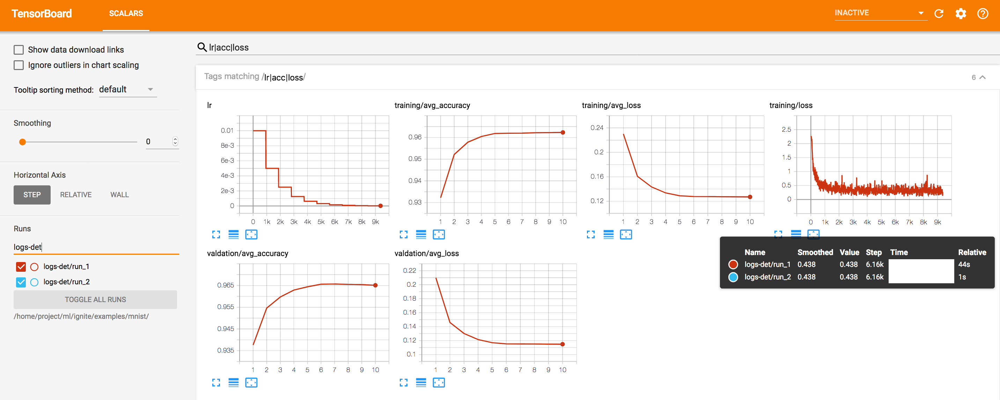
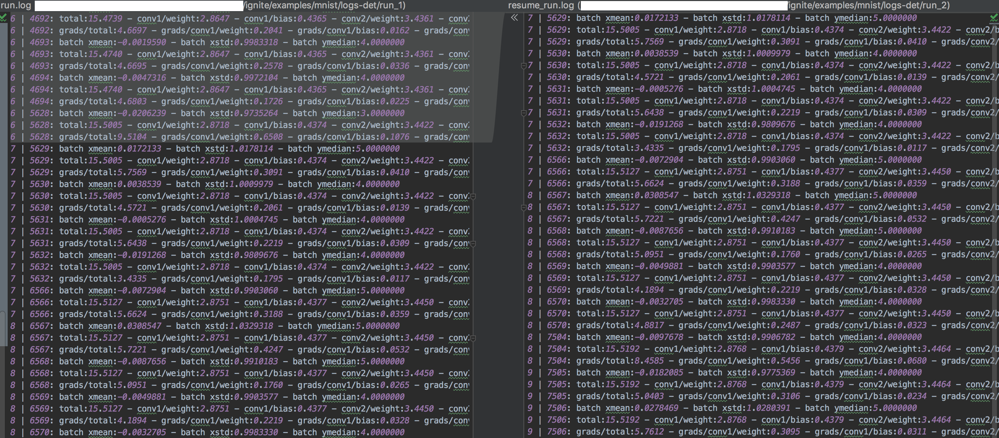
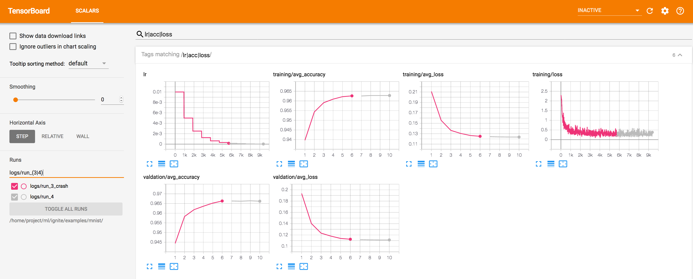
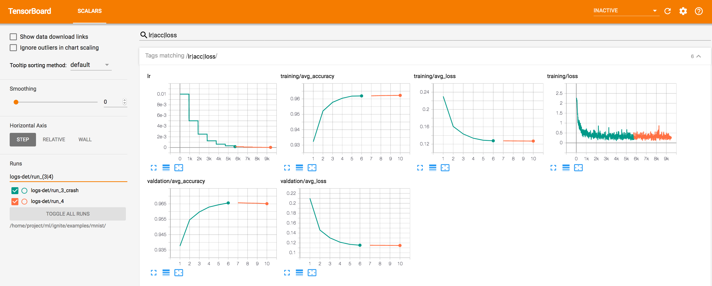
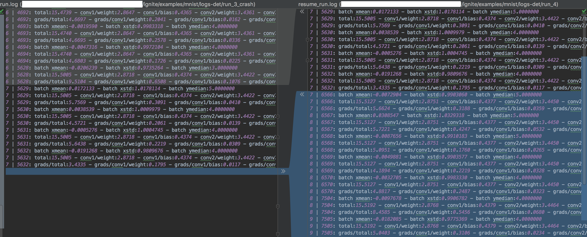

# Basic MNIST Example with Ignite

ported from [pytorch-examples](https://github.com/pytorch/examples/tree/master/mnist)

#### Minimal requirements:

- [torchvision](https://github.com/pytorch/vision/): `pip install torchvision`
- [tqdm](https://github.com/tqdm/tqdm/): `pip install tqdm`

#### Usage:

Run the example:

```bash
python mnist.py
```

Same example with logging using TQDM progress bar

```bash
python mnist_with_tqdm_logger.py
```

### Logging with Tensorboard

MNIST example with training and validation monitoring using Tensorboard

#### Additional requirements:

- Tensorboard: `pip install tensorboard`

Run the example:

```bash
python mnist_with_tensorboard.py --log_dir=/tmp/tensorboard_logs
```

Start tensorboard:

```bash
tensorboard --logdir=/tmp/tensorboard_logs/
```

### Logging with Visdom

MNIST example with training and validation monitoring using Visdom

#### Additional requirements:

- [Visdom](https://github.com/facebookresearch/visdom): `pip install visdom`

#### Usage:

Start visdom:

```bash
python -m visdom.server
```

Run the example:

```bash
python mnist_with_visdom.py
```

### Logging with ClearML

#### Additional requirements:

- [ClearML python client](https://clear.ml/docs/latest/docs/): `pip install clearml`

#### Usage:

```bash
python mnist_with_clearml_logger.py
```

### Training save & resume

Example shows how to save a checkpoint of the trainer, model, optimizer, lr scheduler.
User can resume the training from stored latest checkpoint. In addition, training crash can be emulated.

We provided an option `--deterministic` which setups a deterministic trainer as
[`DeterministicEngine`](https://pytorch.org/ignite/engine.html#ignite.engine.deterministic.DeterministicEngine).
Trainer performs dataflow synchronization on epoch in order to ensure the same dataflow when training is resumed.
Please, see the documentation for more details.

#### Requirements:

- [torchvision](https://github.com/pytorch/vision/): `pip install torchvision`
- [tqdm](https://github.com/tqdm/tqdm/): `pip install tqdm`
- [TensorboardX](https://github.com/lanpa/tensorboard-pytorch): `pip install tensorboardX`
- Tensorboard: `pip install tensorboard`

#### Usage:

Training

```bash
python mnist_save_resume_engine.py --log_dir=logs/run_1 --epochs=10
# or same in deterministic mode
python mnist_save_resume_engine.py --log_dir=logs-det/run_1 --deterministic --epochs=10
```

Resume the training

```bash
python mnist_save_resume_engine.py --log_dir=logs/run_2 --resume_from=logs/run_1/checkpoint_5628.pt --epochs=10
# or same in deterministic mode
python mnist_save_resume_engine.py --log_dir=logs-det/run_2 --resume_from=logs-det/run_1/checkpoint_5628.pt --deterministic --epochs=10
```

Start tensorboard:

```bash
tensorboard --logdir=.
```

The script logs batch stats (mean/std of images, median of targets), model weights' norms and computed gradients norms in
`run.log` and `resume_run.log` to compare training behaviour in both cases.
If set `--deterministic` option, we can observe the same values after resuming the training.

| Non-deterministic                 | Deterministic                         |
| --------------------------------- | ------------------------------------- |
|  |  |

Deterministic `run.log` vs `resume_run.log`


#### Usage with simulated crash

Initial training with a crash

```bash
python mnist_save_resume_engine.py --crash_iteration 5700 --log_dir=logs/run_3_crash --epochs 10
# or same in deterministic mode
python mnist_save_resume_engine.py --crash_iteration 5700 --log_dir=logs-det/run_3_crash --epochs 10 --deterministic
```

Resume from the latest checkpoint

```bash
python mnist_save_resume_engine.py --resume_from logs/run_3_crash/checkpoint_6.pt --log_dir=logs/run_4 --epochs 10
# or same in deterministic mode
python mnist_save_resume_engine.py --resume_from logs-det/run_3_crash/checkpoint_6.pt --log_dir=logs-det/run_4 --epochs 10 --deterministic
```

| Non-deterministic                 | Deterministic                         |
| --------------------------------- | ------------------------------------- |
|  |  |

Deterministic `run.log` vs `resume_run.log`

