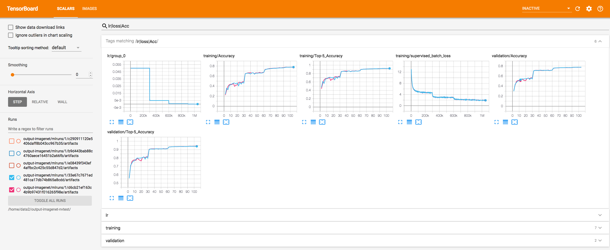
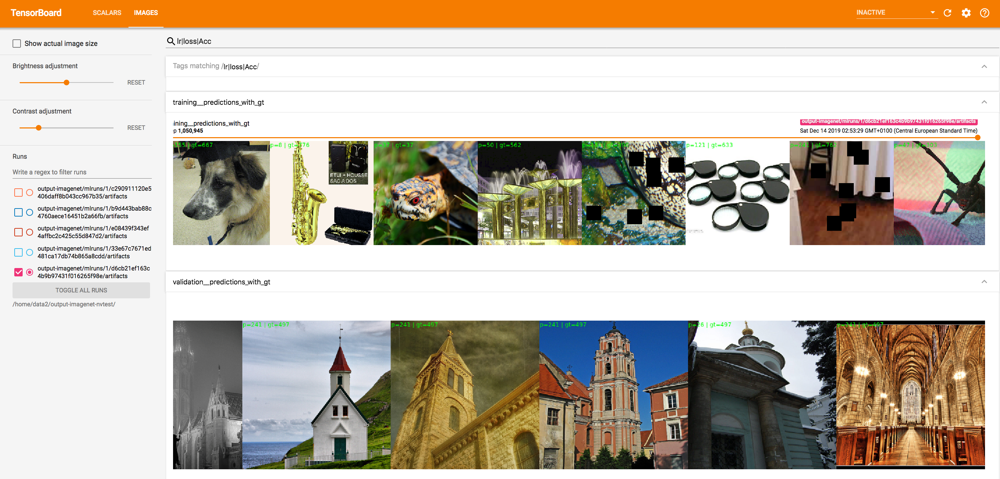

# Reproducible ImageNet training with Ignite

In this example, we provide script and tools to perform reproducible experiments on training neural networks on ImageNet
dataset.

Features:

- Distributed training with mixed precision by [nvidia/apex](https://github.com/NVIDIA/apex/)
- Experiments tracking with [MLflow](https://mlflow.org/) or [Polyaxon](https://polyaxon.com/) or [ClearML](https://github.com/allegroai/clearml)



There are three possible options: 1) Experiments tracking with MLflow, 2) Experiments tracking with Polyaxon or 3) Experiments tracking with ClearML.

Experiments tracking with ClearML / MLflow is more suitable for a local machine with GPU(s). For experiments tracking with Polyaxon
user needs to have Polyaxon installed on a machine/cluster/cloud and can schedule experiments with `polyaxon-cli`.
User can choose one option and skip the descriptions of another option.

- Notes for [experiments tracking with MLflow](NOTES_MLflow.md)
- Notes for [experiments tracking with Polyaxon](NOTES_Polyaxon.md)
- Notes for [experiments tracking with ClearML](NOTES_ClearML.md)

## Implementation details

Files tree description:

```
code
  |___ dataflow : module privides data loaders and various transformers
  |___ scripts : executable training script
  |___ utils : other helper modules

configs
  |___ train : training python configuration files

experiments
  |___ mlflow : MLflow related files
  |___ plx : Polyaxon related files
  |___ clearml : requirements.txt to install ClearML python package

notebooks : jupyter notebooks to check specific parts from code modules
```

## Code and configs

### [py_config_runner](https://github.com/vfdev-5/py_config_runner)

We use [py_config_runner](https://github.com/vfdev-5/py_config_runner) package to execute python scripts with python configuration files.

### Training script

Training script is located [code/scripts](code/scripts/) and contains

- `training.py`, single training script with possiblity to use one of MLflow / Polayaxon / ClearML experiments tracking systems.

Training script contains `run` method required by [py_config_runner](https://github.com/vfdev-5/py_config_runner) to
run a script with a configuration.

The split between training script and configuration python file is the following.
Configuration file being a python script defines necessary components for neural network training:

- Dataflow: training/validation/train evaluation data loaders with custom data augmentations
- Model
- Optimizer
- Criterion
- LR scheduler
- other parameters: device, number of epochs, etc

Training script uses these components to setup and run training and validation loops. By default,
processing group with "nccl" backend is initialized for distributed configuration (even for a single GPU).

Training script is generic, uses [`ignite.distributed` API](https://pytorch.org/ignite/master/distributed.html), and adapts
training components to provided distributed configuration (e.g. uses DistribtedDataParallel model wrapper,
uses distributed sampling, scales batch size etc).

### Configurations

- [baseline_resnet50.py](configs/train/baseline_resnet50.py) : trains ResNet50

### Results

| Model     | Training Top-1 Accuracy | Training Top-5 Accuracy | Test Top-1 Accuracy | Test Top-5 Accuracy |
| --------- | ----------------------- | ----------------------- | ------------------- | ------------------- |
| ResNet-50 | 78%                     | 92%                     | 77%                 | 94%                 |

## Acknowledgements

Part of trainings was done within [Tesla GPU Test Drive](https://www.nvidia.com/en-us/data-center/tesla/gpu-test-drive/)
on 2 Nvidia V100 GPUs.


