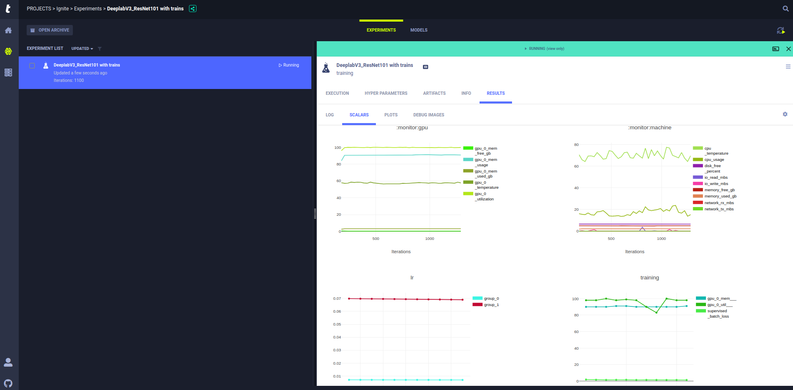

# Experiments tracking with Trains

**Allegro Trains** is a full system open source ML / DL experiment manager and ML-Ops solution. 
It is composed of a server, Python SDK and web UI. **Allegro Trains** enables data scientists and data engineers 
to effortlessly track, manage, compare and collaborate on their experiments as well as easily manage their 
training workloads on remote machines.



## Install trains

Install [trains](https://github.com/allegroai/trains) by executing the following command:

```bash
pip install trains
```

## Install The Segmentation Example Python Requirements 

```bash
pip install -r requirements.txt
```
  
## Download Pascal VOC2012 and SDB datasets

Download and extract the datasets:

```bash
python code/scripts/download_dataset.py /path/to/datasets
```

This script will download and extract the following datasets into `/path/to/datasets`

* The [Pascal VOC2012](http://host.robots.ox.ac.uk/pascal/VOC/voc2012/VOCtrainval_11-May-2012.tar) dataset
* Optionally, the [SBD](http://www.eecs.berkeley.edu/Research/Projects/CS/vision/grouping/semantic_contours/benchmark.tgz) evaluation dataset

## Setup the environment variables

### Setup the dataset path

Export the ``DATASET_PATH`` environment variable for the Pascal VOC2012 dataset.

```bash
export DATASET_PATH=/path/to/datasets
```
        
### Setup the SBD dataset path

Export the ``SBD_DATASET_PATH`` environment variable for the SBD evaluation dataset.

```bash
export SBD_DATASET_PATH=/path/to/datasets
```

## Run the experiment code

In **Trains**, when you run the experiment code, ``trains`` stores the experiment in [trains-server](https://github.com/allegroai/trains-server). 

By default, ``trains`` works with the demo **Trains Server** ([https://demoapp.trains.allegro.ai/dashboard](https://demoapp.trains.allegro.ai/dashboard)), 
which is open to anyone (although once a week it is refreshing and deleting all data). You can also set up your own self-hosted **Trains Server**. 

After the experiment code runs once, you can [reproduce the experiment](#reproducing-the-experiment) using the 
**Trains Web-App (UI)**, which is part of ``trains-server``. You only need to run the code once to store it 
in ``trains-server``.

### Run the code

Execute the following command: 

```bash
python -m py_config_runner ./code/scripts/trains_training.py ./configs/train/baseline_resnet101.py  --manual_config_load
```

In **Trains Web-App** a new project named *"ignite"* will be created, 
with an experiment named *"DeeplabV3_ResNet101 pascal_voc2012 segmentation example"* inside.

In your local environment, the console output includes the URL of the experiment's **RESULTS** page.

```console
TRAINS results page: https://demoapp.trains.allegro.ai/projects/21643e0f1c4a4c99953302fc88a1a84c/experiments/60763e04c0ba45ea9fe3cfe79f3f06a3/output/log
```
 
You can now view your experiment in **Trains** by clicking the link or copying the URL into your browser. 
It opens the results in the experiment's details pane, in the **Trains Web-App (UI)**.


#### Trains automatic Logging

When the experiment code runs, **Trains** automatically logs your environment, code, and the outputs.
Which means that you don't need to change your code.

All you need is 2 lines of integration (`import` and `Task.init`) at the top of your main script,
and the following will be logged by **Trains**:

* **Resource Monitoring** CPU/GPU utilization, temperature, IO, network, etc
* **Development Environment** Python environment, Git (repo, branch, commit) including uncommitted changes
* **Configuration** Including configuration files, command line arguments (ArgParser), and general dictionaries
* Full **stdout** and **stderr** automatic logging
* Model snapshots, with optional automatic upload to central storage.  
Storage options include shared folders, S3, GS, Azure, and http/s
* Artifacts log & store, including shared folders, S3, GS, Azure, and Http/s
* Matplotlib / Seaborn / TensorBoard / TensorBoardX scalars, metrics, histograms, images, audio, video, etc 

Additionally, **Trains** supports explicit logging by adding calls to the **Trains** Python client ``Logger`` 
class methods in the code. For more information, 
see [Explicit Reporting](https://allegro.ai/docs/examples/examples_explicit_reporting/) in the **Trains** documentation.    

## Track the experiment and visualize the results

In the **Trains Web-App (UI)**, track the experiment and visualize results in the experiment's details pane, 
which is organized in tabs and provides the following information;

* Source code, uncommitted changes, Python packages and versions, and other information, in the **EXECUTION** tab
* Hyperparameters in the **HYPERPARAMETERS** tab
* Input model, Configuration, Output model, and other artifacts in the **ARTIFACTS** tab
* Experiment Comments and General experiment information in the **INFO** tab
* Results in the **RESULTS** tab, including the log, scalar metric plots, plots of any data, and debug samples

## Reproducing the experiments

In **Trains**, reproduce experiments using ``trains-agent`` for remote execution. Rerun the same experiment, 
by making an exact copy of it (a clone), and remotely execute the cloned experiment.

First, install ``trains-agent`` and then configure it to work with your self-hosted **Trains Server**. 

Once ``trains-agent`` is installed and configured, run ``trains-agent daemon``.
In **Trains**, we call these *workers*, they pop experiments from a job execution queue and execute them. 
Every machine with a *trains-agent daemon*, becomes a registered *worker* in your **trains-server** cluster.

Using the **Trains Web-App**  you can easily send experiments to be remotely executed on one of these machines. 

More details can be found on the *trains-agent* [github](https://github.com/allegroai/trains-agent/)

### Install and configure trains-agent

1. Install ``trains-agent``

        pip install trains-agent
        
1. Configure ``trains-agent`` by running the setup wizard

        trains-agent init        

### Remotely execute the experiment

1. Start a **Trains** worker. Run a ``trains-agent daemon`` listening to a queue

    For example, run a ``trains-agent daemon`` listening to the ``default`` queue and using multiple GPUs.

        trains-agent daemon --gpus 0,1 --queue default
        
1. Locate the experiment. In the **Trains Web-App (UI)**, Projects page, click on the project card

1. Make a copy of the experiment
    1. In the experiment table, right-click the experiment
    1. On the sub-menu, select **Clone**
    1. Select the project, type a name for the copy, and type a description, or accept the defaults
    1. Click the **CLONE** button

    The copy of the experiment is created. Its details pane opens.
    
1. Send the experiment for remote execution, by enqueuing it in one of the job execution queues

    1. In the experiment table, right-click the experiment
    1. On the sub-menu, select **Enqueue**
    1. Select the *default* queue
    1. Click the **ENQUEUE** button
    
    The experiment's status changes to Pending.

When the experiment reaches the top of the job execution queue, the ``trains-agent deamon`` fetches it, 
its status changes to Running, and ``trains-agent`` executes it while logging and monitoring. 
You can track the experiment while it is in progress, and anytime afterwards.
