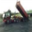

# Super-Resolution using an efficient sub-pixel convolutional neural network

ported from [pytorch-examples](https://github.com/pytorch/examples/tree/main/super_resolution)

This example illustrates how to use the efficient sub-pixel convolution layer described in ["Real-Time Single Image and Video Super-Resolution Using an Efficient Sub-Pixel Convolutional Neural Network" - Shi et al. 2016](https://arxiv.org/abs/1609.05158) for increasing spatial resolution within your network for tasks such as superresolution.

```
usage: main.py [-h] --upscale_factor UPSCALE_FACTOR [--crop_size CROPSIZE] [--batch_size BATCHSIZE]
               [--test_batch_size TESTBATCHSIZE] [--n_epochs NEPOCHS] [--lr LR]
               [--cuda] [--threads THREADS] [--seed SEED] [--debug]

PyTorch Super Res Example

optional arguments:
  -h, --help            show this help message and exit
  --upscale_factor      super resolution upscale factor
  --crop_size           cropped size of the images for training
  --batch_size           training batch size
  --test_batch_size       testing batch size
  --n_epochs             number of epochs to train for
  --lr                  Learning Rate. Default=0.01
  --cuda                use cuda
  --mps                 enable GPU on macOS
  --threads             number of threads for data loader to use Default=4
  --seed                random seed to use. Default=123
  --debug               debug mode for testing
```

This example trains a super-resolution network on the [Caltech101 dataset](https://pytorch.org/vision/main/generated/torchvision.datasets.Caltech101.html). A snapshot of the model after every epoch with filename `model_epoch_<epoch_number>.pth`

## Example Usage:

### Train

`python main.py --upscale_factor 3 --crop_size 180 --batch_size 4 --test_batch_size 100 --n_epochs 30 --lr 0.001`

### Super-Resolve

`python super_resolve.py --input_image <in>.jpg --model model_epoch_500.pth --output_filename out.png`

### Super-resolve example on a Cifar-10 image

#### Input Image



#### Output Images

| Output image from Model                       | Output from bicubic sampling                                            |
| --------------------------------------------- | ----------------------------------------------------------------------- |
|  |  |
